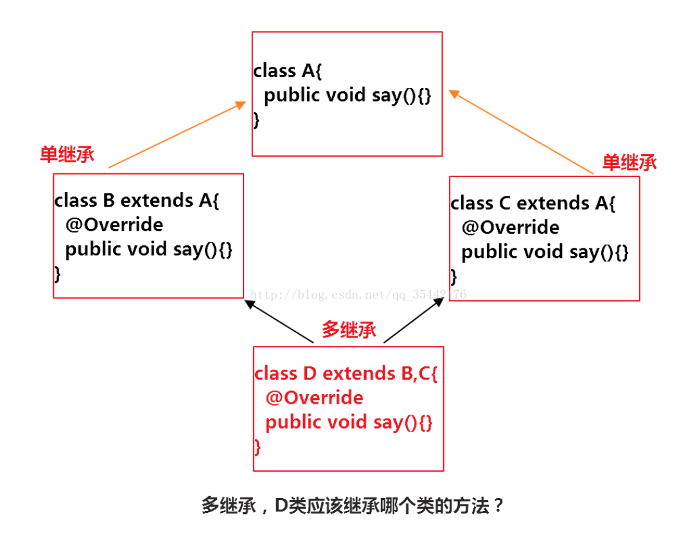

<!-- TOC -->

- [面向对象和面向过程](#面向对象和面向过程)
    - [什么是面向过程](#什么是面向过程)
    - [什么是面向对象](#什么是面向对象)
    - [面向对象的三个基本特征](#面向对象的三个基本特征)
    - [多态的理解](#多态的理解)
    - [super](#super)
    - [重写和重载的区别。](#重写和重载的区别)
    - [为什么Java是单继承？](#为什么java是单继承)
    - [继承的好处和坏处](#继承的好处和坏处)
    - [Java 中是否可以覆盖(override)一个 private 或者是 static 的方法？](#java-中是否可以覆盖override一个-private-或者是-static-的方法)
    - [public,protected,private,以及默认](#publicprotectedprivate以及默认)
    - [接口和抽象类](#接口和抽象类)
- [一、数据类型](#一数据类型)
    - [基本类型和包装类型](#基本类型和包装类型)
    - [装箱/拆箱](#装箱拆箱)
    - [String 转出 int 型， 判断能不能转？ 如何转？](#string-转出-int-型-判断能不能转-如何转)
    - [short s1 = 1; s1 = s1 + 1;有什么错? short s1 =1; s1 +=1;有什么错?](#short-s1--1-s1--s1--1有什么错-short-s1-1-s1-1有什么错)
    - [Int 与 Integer 区别](#int-与-integer-区别)
    - [缓存池](#缓存池)
- [二、String](#二string)
    - [概览](#概览)
    - [不可变的好处](#不可变的好处)
    - [String, StringBuffer and StringBuilder](#string-stringbuffer-and-stringbuilder)
    - [String Pool](#string-pool)
    - [new String("abc")](#new-stringabc)
- [三、Object 通用方法](#三object-通用方法)
    - [概览](#概览-1)
    - [equals()](#equals)
    - [hashCode()](#hashcode)
    - [toString()](#tostring)
    - [clone()](#clone)
- [六、关键字](#六关键字)
    - [final](#final)
    - [static](#static)
- [七、反射](#七反射)
- [八、异常](#八异常)
- [九、泛型](#九泛型)
- [十、注解](#十注解)
- [十一、特性](#十一特性)
    - [Java 与 C++ 的区别](#java-与-c-的区别)
    - [JRE or JDK](#jre-or-jdk)
- [其他](#其他)
    - [map，list，set区别](#maplistset区别)
    - [comparable接口和comparator接口](#comparable接口和comparator接口)
    - [ThreadLocal](#threadlocal)
    - [finalize finalization finally](#finalize-finalization-finally)
    - [值传递与引用传递](#值传递与引用传递)
    - [四种引用](#四种引用)

<!-- /TOC -->


# 面向对象和面向过程

## 什么是面向过程
- 就是分析出解决问题所需要的步骤，然后用函数把这些步骤一步一步实现，使用的时候一个一个依次调用就可以了。
- 优点：性能比面向对象高，因为类调用时需要实例化，开销比较大，比较消耗资源;比如单片机、嵌入式开发、 Linux/Unix等一般采用面向过程开发，性能是最重要的因素。 
- 缺点：没有面向对象易维护、易复用、易扩展

## 什么是面向对象
  面向对象思想一种思想，是基于面向过程而言的，就是说面向对象是将功能等通过对象来实现，将功能封装进对象之中，让对象去实现具体的细节；这种思想是将数据作为第一位，而方法或者说是算法作为其次，这是对数据一种优化，操作起来更加的方便，简化了过程。
- 优点：易维护、易复用、易扩展，由于面向对象有封装、继承、多态性的特性，可以设计出低耦合的系统，使系统 更加灵活、更加易于维护 
- 缺点：性能比面向过程低

## 面向对象的三个基本特征
- 封装，也就是把客观事物封装成抽象的类，并且类可以把自己的数据和方法只让可信的类或者对象操作，对不可信的进行信息隐藏。
- 继承：是对有着共同特性的多类事物，进行再抽象成一个类。这个类就是多类事物的父类。父类的意义在于抽取多类事物的共性。
- 多态：允许不同类的对象对同一消息做出不同的响应。

## 多态的理解
- 方法重载 (overload)实现的是编译时的多态性(也称为前绑定)
- 方法重写 (override) 实现的是运行时的多态性(也称为后绑定)
- 要实现多态需要做两件事：
	- 方法重写（子类继承父类并重写父类中已有的或抽象的方法）；
	- 对象造型（用父类型引用引用子类型对象，这样同样的引用调用同样的方法就会根据子类对象的不同而表现出不同的行为）。
- 项目中对多态的应用:
	- 举一个简单的例子：在物流管理系统中，有两种用户：订购客户和卖方客户，两个客户都可以登录系统，他们有相同的方法login，但登陆之后他们会进入不同的页面，也就是在登录的时候会有不同的操作，两种客户都继承父类的login方法，但对于不同的对象，拥有不同的操作。

## super

- 访问父类的构造函数：可以使用 super() 函数访问父类的构造函数，从而委托父类完成一些初始化的工作。
- 访问父类的成员：如果子类重写了父类的某个方法，可以通过使用 super 关键字来引用父类的方法实现。

```java
public class SuperExample {

    protected int x;
    protected int y;

    public SuperExample(int x, int y) {
        this.x = x;
        this.y = y;
    }

    public void func() {
        System.out.println("SuperExample.func()");
    }
}
```

```java
public class SuperExtendExample extends SuperExample {

    private int z;

    public SuperExtendExample(int x, int y, int z) {
        super(x, y);
        this.z = z;
    }

    @Override
    public void func() {
        super.func();
        System.out.println("SuperExtendExample.func()");
    }
}
```

```java
SuperExample e = new SuperExtendExample(1, 2, 3);
e.func();
```

```html
SuperExample.func()
SuperExtendExample.func()
```

## 重写和重载的区别。
- 重载
	- 发生在同一个类中
	- 方法名必须相同，
	- 参数类型不同、个数不同、顺序不同，方法返回值和访问修饰符可以不同，	发生在编译时。
- 重写
	- 发生在父子类中
	- 方法名、参数列表必须相同
	- 子类方法的访问权限必须大于等于父类方法；
	- 子类方法的返回类型必须是父类方法返回类型或为其子类型。
	- 子类方法抛出的异常类型必须是父类抛出异常类型或为其子类型。如果父类方法访问修饰符为private则子类中不可见，也就不是重写。
	- 发生在运行时。
- 下面的示例中，SubClass 为 SuperClass 的子类，SubClass 重写了 SuperClass 的 func() 方法。其中：
	- 子类方法访问权限为 public，大于父类的 protected。
	- 子类的返回类型为 ArrayList，是父类返回类型 List 的子类。
	- 子类抛出的异常类型为 Exception，是父类抛出异常 Throwable 的子类。
	- 子类重写方法使用 @Override 注解，从而让编译器自动检查是否满足限制条件。
```
class SuperClass {
    protected List<Integer> func() throws Throwable {
        return new ArrayList<>();
    }
}

class SubClass extends SuperClass {
    @Override
    public ArrayList<Integer> func() throws Exception {
        return new ArrayList<>();
    }
}
```
在调用一个方法时，先从本类中查找看是否有对应的方法，如果没有查找到再到父类中查看，看是否有继承来的方法。否则就要对参数进行转型，转成父类之后看是否有对应的方法。总的来说，方法调用的优先级为：

- this.func(this)
- super.func(this)
- this.func(super)
- super.func(super)


```java
/*
    A
    |
    B
    |
    C
    |
    D
 */


class A {

    public void show(A obj) {
        System.out.println("A.show(A)");
    }

    public void show(C obj) {
        System.out.println("A.show(C)");
    }
}

class B extends A {

    @Override
    public void show(A obj) {
        System.out.println("B.show(A)");
    }
}

class C extends B {
}

class D extends C {
}
```

```java
public static void main(String[] args) {

    A a = new A();
    B b = new B();
    C c = new C();
    D d = new D();

    // 在 A 中存在 show(A obj)，直接调用
    a.show(a); // A.show(A)
    // 在 A 中不存在 show(B obj)，将 B 转型成其父类 A
    a.show(b); // A.show(A)
    // 在 B 中存在从 A 继承来的 show(C obj)，直接调用
    b.show(c); // A.show(C)
    // 在 B 中不存在 show(D obj)，但是存在从 A 继承来的 show(C obj)，将 D 转型成其父类 C
    b.show(d); // A.show(C)

    // 引用的还是 B 对象，所以 ba 和 b 的调用结果一样
    A ba = new B();
    ba.show(c); // A.show(C)
    ba.show(d); // A.show(C)
}
```

## 为什么Java是单继承？
<div align="center">  </div><br>

## 继承的好处和坏处
- 好处： 
	- 1. 子类能自动继承父类的接口
	- 2. 创建子类的对象时，无须创建父类的对象
- 坏处:	
	- 1. 破坏封装，子类与父类之间紧密耦合，子类依赖于父类的实现，子类缺乏独立性
	- 2. 支持扩展，但是往往以增加系统结构的复杂度为代价
	- 3. 不支持动态继承。在运行时，子类无法选择不同的父类
	- 4. 子类不能改变父类的接口


## Java 中是否可以覆盖(override)一个 private 或者是 static 的方法？
- static 方法是编译时静态绑定，方法覆盖是基于运行时动态绑定
- private 修饰的变量和方法只能在当前类中使用，不能被继承。子类中访问不到。当然也不能覆盖。

## public,protected,private,以及默认
- public在任何地方都能访问；
- protected在同包内的类及包外的子类能访问；
- private只有在本类中才能访问；
- 默认不写在同包内能访问。

## 接口和抽象类
**1. 抽象类** 

- 抽象类是什么：
抽象类不能创建实例，它只能作为父类被继承。抽象类是从多个具体类中抽象出来的父类，它具有更高层次的抽象。从多个具有相同特征的类中抽象出一个抽象类，以这个抽象类作为其子类的模板，从而避免了子类的随意性。
	- (1) 抽象方法只作声明，而不包含实现，可以看成是没有实现体的虚方法
	- (2) 抽象类不能被实例化
	- (3) 抽象类可以但不是必须有抽象属性和抽象方法，但是一旦有了抽象方法，就一定要把这个类声明为抽象类
	- (4) 具体派生类必须覆盖基类的抽象方法
	- (5) 抽象派生类可以覆盖基类的抽象方法，也可以不覆盖。如果不覆盖，则其具体派生类必须覆盖它们
- 抽象类和抽象方法都使用 abstract 关键字进行声明。如果一个类中包含抽象方法，那么这个类必须声明为抽象类。
- 抽象类和普通类最大的区别是，抽象类不能被实例化，需要继承抽象类才能实例化其子类。

```java
public abstract class AbstractClassExample {

    protected int x;
    private int y;

    public abstract void func1();

    public void func2() {
        System.out.println("func2");
    }
}
```

```java
public class AbstractExtendClassExample extends AbstractClassExample {
    @Override
    public void func1() {
        System.out.println("func1");
    }
}
```

```java
// AbstractClassExample ac1 = new AbstractClassExample(); // 'AbstractClassExample' is abstract; cannot be instantiated
AbstractClassExample ac2 = new AbstractExtendClassExample();
ac2.func1();
```

**2. 接口** 

接口是抽象类的延伸，在 Java 8 之前，它可以看成是一个完全抽象的类，也就是说它不能有任何的方法实现。

从 Java 8 开始，接口也可以拥有默认的方法实现，这是因为不支持默认方法的接口的维护成本太高了。在 Java 8 之前，如果一个接口想要添加新的方法，那么要修改所有实现了该接口的类。

- 1.在接口中只有方法的声明，没有方法体。 （Java8 接口可以有实例方法） 
- 2.在接口中只有常量，因为定义的变量，在编译的时候都会默认加上 public static final (必须被初始化，不能改变) 
- 3.在接口中的方法，永远都被public来修饰(只能)。 
- 4.接口中没有构造方法，也不能实例化接口的对象。 
- 5.接口可以实现多继承 
- 6.接口中定义的方法都需要有实现类来实现，如果实现类不能实现接口中的所有方法则实现类定义为抽象类。

```java
public interface InterfaceExample {

    void func1();

    default void func2(){
        System.out.println("func2");
    }

    int x = 123;
    // int y;               // Variable 'y' might not have been initialized
    public int z = 0;       // Modifier 'public' is redundant for interface fields
    // private int k = 0;   // Modifier 'private' not allowed here
    // protected int l = 0; // Modifier 'protected' not allowed here
    // private void fun3(); // Modifier 'private' not allowed here
}
```

```java
public class InterfaceImplementExample implements InterfaceExample {
    @Override
    public void func1() {
        System.out.println("func1");
    }
}
```

```java
// InterfaceExample ie1 = new InterfaceExample(); // 'InterfaceExample' is abstract; cannot be instantiated
InterfaceExample ie2 = new InterfaceImplementExample();
ie2.func1();
System.out.println(InterfaceExample.x);
```

**3. 区别** 

- 从设计层面上看，抽象类提供了一种 IS-A 关系，那么就必须满足里式替换原则，即子类对象必须能够替换掉所有父类对象。而接口更像是一种 LIKE-A 关系，它只是提供一种方法实现契约，并不要求接口和实现接口的类具有 IS-A 关系。
- 从使用上来看，一个类可以实现多个接口，但是不能继承多个抽象类。
- 接口的字段只能是 static 和 final 类型的，而抽象类的字段没有这种限制。
- 接口的成员只能是 public 的，而抽象类的成员可以有多种访问权限。
- 接口中所有的方法隐含的都是抽象的。而抽象类则可以同时包含抽象和非抽象的方法。（Java8 接口可以有实例方法 需要关键字default）
- Java接口中声明的变量默认是public static final（必须赋初始值）。抽象类可以包含非final的变量。
- 接口可继承接口，不能继承类（抽象类和普通类）;抽象类可继承接口也可继承具体类（继承接口时可只实现部分方法）
- 非抽象类如果要实现一个接口，它必须要实现接口声明的所有方法。类可以不实现抽象类或接口声明的所有方法，当然，在这种情况下，类也必须得声明成是抽象的。
<div align="center">  </div><br>
**4. 使用选择** 

使用接口：

- 需要让不相关的类都实现一个方法，例如不相关的类都可以实现 Compareable 接口中的 compareTo() 方法；
- 需要使用多重继承。

使用抽象类：

- 需要在几个相关的类中共享代码。
- 需要能控制继承来的成员的访问权限，而不是都为 public。
- 需要继承非静态和非常量字段。

在很多情况下，接口优先于抽象类。因为接口没有抽象类严格的类层次结构要求，可以灵活地为一个类添加行为。并且从 Java 8 开始，接口也可以有默认的方法实现，使得修改接口的成本也变的很低。

- [Abstract Methods and Classes](https://docs.oracle.com/javase/tutorial/java/IandI/abstract.html)
- [深入理解 abstract class 和 interface](https://www.ibm.com/developerworks/cn/java/l-javainterface-abstract/)
- [When to Use Abstract Class and Interface](https://dzone.com/articles/when-to-use-abstract-class-and-intreface)


# 一、数据类型

## 基本类型和包装类型
- 基本类型
boolean， byte/8， char/16，short/16，int/32，float/32，long/64，double/64
- 包装类型
Boolean， Byte，Character， Short， Integer， Float， Long， Double
boolean 只有两个值：true、false，可以使用 1 bit 来存储，但是具体大小没有明确规定。JVM 会在编译时期将 boolean 类型的数据转换为 int，使用 1 来表示 

## 装箱/拆箱
- 装箱：将基本类型转换为包装类型；
- 拆箱：将包装类型转换为基本数据类型；
Java使用自动装箱和拆箱机制，节省了常用数值的内存开销和创建对象的开销，提高了效率，由编译器来完成，编译器会在编译期根据语法决定是否进行装箱和拆箱动作。
	
   - 进行 = 赋值操作（装箱或拆箱）
	- 进行+，-，*，/混合运算 （拆箱）
	- 进行>,<,==比较运算（拆箱）
	- 调用equals进行比较（装箱）
   - ArrayList,HashMap等集合类 添加基础类型数据时（装箱）  

## String 转出 int 型， 判断能不能转？ 如何转？
答： 可以转， 得处理异常 Integer.parseInt(s) 主要为 NumberFormatException： 1） 当你输入为字母时， 也就是内容不是数字时， 如 abcd 2） 当你输入为空时 3） 当你输入超出int 上限时

## short s1 = 1; s1 = s1 + 1;有什么错? short s1 =1; s1 +=1;有什么错?
-  对于 short s1=1;s1=s1+1 来说， 在 s1+1 运算时会自动提升表达式的类型为 int，那么将 int 赋予给 short 类型的变量 s1 会出现类型转换错误。
-  对于 short s1=1;s1+=1 来说 +=是 java 语言规定的运算符， java 编译器会对它进行特殊处理， 因此可以正确编译。
## Int 与 Integer 区别
- int和Integer的区别
   - 1、Integer是int的包装类，int则是java的一种基本数据类型 
   - 2、Integer变量必须实例化后才能使用，而int变量不需要 
   - 3、Integer实际是对象的引用，当new一个Integer时，实际上是生成一个指针指向此对象；而int则是直接存储数据值 
   - 4、Integer的默认值是null，int的默认值是0
- 延伸： 
关于Integer和int的比较 
- 1、由于Integer变量实际上是对一个Integer对象的引用，所以两个通过new生成的Integer变量永远是不相等的（因为new生成的是两个对象，其内存地址不同）。
```
Integer i = new Integer(100);
Integer j = new Integer(100);
System.out.print(i == j); //false
```
- 2、Integer变量和int变量比较时，只要两个变量的值是向等的，则结果为true（因为包装类Integer和基本数据类型int比较时，java会自动拆包装为int，然后进行比较，实际上就变为两个int变量的比较）
```
Integer i = new Integer(100);
int j = 100；
System.out.print(i == j); //true
```
- 3、非new生成的Integer变量和new Integer()生成的变量比较时，结果为false。（因为非new生成的Integer变量指向的是java常量池中的对象，而new Integer()生成的变量指向堆中新建的对象，两者在内存中的地址不同）
```
Integer i = new Integer(100);
Integer j = 100;
System.out.print(i == j); //false
```
- 4、对于两个非new生成的Integer对象，进行比较时，如果两个变量的值在区间-128到127之间，则比较结果为true，如果两个变量的值不在此区间，则比较结果为false
```
Integer i = 100;
Integer j = 100;
System.out.print(i == j); //true
Integer i = 128;
Integer j = 128;
System.out.print(i == j); //false
```
java对于-128到127之间的数，会进行缓存，Integer i = 127时，会将127进行缓存，下次再写Integer j = 127时，就会直接从缓存中取，就不会new了

## 缓存池

new Integer(123) 与 Integer.valueOf(123) 的区别在于：

- new Integer(123) 每次都会新建一个对象；
- Integer.valueOf(123) 会使用缓存池中的对象，多次调用会取得同一个对象的引用。

```java
Integer x = new Integer(123);
Integer y = new Integer(123);
System.out.println(x == y);    // false
Integer z = Integer.valueOf(123);
Integer k = Integer.valueOf(123);
System.out.println(z == k);   // true
```

valueOf() 方法的实现比较简单，就是先判断值是否在缓存池中，如果在的话就直接返回缓存池的内容。
在 Java 8 中，Integer 缓存池的大小默认为 -128\~127。
编译器会在自动装箱过程调用 valueOf() 方法，因此多个值相同且值在缓存池范围内的 Integer 实例使用自动装箱来创建，那么就会引用相同的对象。

```java
Integer m = 123;
Integer n = 123;
System.out.println(m == n); // true
```

基本类型对应的缓冲池如下：

- boolean values true and false
- all byte values
- short values between -128 and 127
- int values between -128 and 127
- char in the range \u0000 to \u007F

在使用这些基本类型对应的包装类型时，如果该数值范围在缓冲池范围内，就可以直接使用缓冲池中的对象。

在 jdk 1.8 所有的数值类缓冲池中，Integer 的缓冲池 IntegerCache 很特殊，这个缓冲池的下界是 - 128，上界默认是 127，但是这个上界是可调的，在启动 jvm 的时候，通过 -XX:AutoBoxCacheMax=&lt;size&gt; 来指定这个缓冲池的大小，该选项在 JVM 初始化的时候会设定一个名为 java.lang.IntegerCache.high 系统属性，然后 IntegerCache 初始化的时候就会读取该系统属性来决定上界。

[StackOverflow : Differences between new Integer(123), Integer.valueOf(123) and just 123
](https://stackoverflow.com/questions/9030817/differences-between-new-integer123-integer-valueof123-and-just-123)

# 二、String

## 概览

String 被声明为 final，因此它不可被继承。

在 Java 8 中，String 内部使用 char 数组存储数据。

```java
public final class String
    implements java.io.Serializable, Comparable<String>, CharSequence {
    /** The value is used for character storage. */
    private final char value[];
}
```

在 Java 9 之后，String 类的实现改用 byte 数组存储字符串，同时使用 `coder` 来标识使用了哪种编码。

```java
public final class String
    implements java.io.Serializable, Comparable<String>, CharSequence {
    /** The value is used for character storage. */
    private final byte[] value;

    /** The identifier of the encoding used to encode the bytes in {@code value}. */
    private final byte coder;
}
```

value 数组被声明为 final，这意味着 value 数组初始化之后就不能再引用其它数组。并且 String 内部没有改变 value 数组的方法，因此可以保证 String 不可变。

## 不可变的好处

**1. 可以缓存 hash 值** 

因为 String 的 hash 值经常被使用，例如 String 用做 HashMap 的 key。不可变的特性可以使得 hash 值也不可变，因此只需要进行一次计算。

**2. String Pool 的需要** 

如果一个 String 对象已经被创建过了，那么就会从 String Pool 中取得引用。只有 String 是不可变的，才可能使用 String Pool。

<div align="center">  </div><br>

**3. 安全性** 

String 经常作为参数，String 不可变性可以保证参数不可变。例如在作为网络连接参数的情况下如果 String 是可变的，那么在网络连接过程中，String 被改变，改变 String 对象的那一方以为现在连接的是其它主机，而实际情况却不一定是。

**4. 线程安全** 

String 不可变性天生具备线程安全，可以在多个线程中安全地使用。

[Program Creek : Why String is immutable in Java?](https://www.programcreek.com/2013/04/why-string-is-immutable-in-java/)

## String, StringBuffer and StringBuilder

**1. 可变性** 

- String 不可变，private final char value[]
- StringBuffer 和 StringBuilder 可变，继承自AbstractStringBuilder类，在AbstractStringBuilder中也是使用字符数组保存字符串，char[]
value

**2. 线程安全** 

- String 不可变，因此是线程安全的
- StringBuilder 不是线程安全的，
- StringBuffer 是线程安全的，内部使用 synchronized 进行同步

[StackOverflow : String, StringBuffer, and StringBuilder](https://stackoverflow.com/questions/2971315/string-stringbuffer-and-stringbuilder)

**3. 性能**  
- String最慢。每次对String 类型进行改变的时候，都会生成一个新的String 对象，然后将指针指向新的String 对象
- StringBuilder比StringBuffer快约10%~15%

## String Pool

字符串常量池（String Pool）保存着所有字符串字面量（literal strings），这些字面量在编译时期就确定。不仅如此，还可以使用 String 的 intern() 方法在运行过程中将字符串添加到 String Pool 中。

当一个字符串调用 intern() 方法时，如果 String Pool 中已经存在一个字符串和该字符串值相等（使用 equals() 方法进行确定），那么就会返回 String Pool 中字符串的引用；否则，就会在 String Pool 中添加一个新的字符串，并返回这个新字符串的引用。

下面示例中，s1 和 s2 采用 new String() 的方式新建了两个不同字符串，而 s3 和 s4 是通过 s1.intern() 方法取得一个字符串引用。intern() 首先把 s1 引用的字符串放到 String Pool 中，然后返回这个字符串引用。因此 s3 和 s4 引用的是同一个字符串。

```java
String s1 = new String("aaa");
String s2 = new String("aaa");
System.out.println(s1 == s2);           // false
String s3 = s1.intern();
String s4 = s1.intern();
System.out.println(s3 == s4);           // true
```

如果是采用 "bbb" 这种字面量的形式创建字符串，会自动地将字符串放入 String Pool 中。

```java
String s5 = "bbb";
String s6 = "bbb";
System.out.println(s5 == s6);  // true
```

在 Java 7 之前，String Pool 被放在运行时常量池中，它属于永久代。而在 Java 7，String Pool 被移到堆中。这是因为永久代的空间有限，在大量使用字符串的场景下会导致 OutOfMemoryError 错误。

- [StackOverflow : What is String interning?](https://stackoverflow.com/questions/10578984/what-is-string-interning)
- [深入解析 String#intern](https://tech.meituan.com/in_depth_understanding_string_intern.html)

## new String("abc")

使用这种方式一共会创建两个字符串对象（前提是 String Pool 中还没有 "abc" 字符串对象）。

- "abc" 属于字符串字面量，因此编译时期会在 String Pool 中创建一个字符串对象，指向这个 "abc" 字符串字面量；
- 而使用 new 的方式会在堆中创建一个字符串对象。

创建一个测试类，其 main 方法中使用这种方式来创建字符串对象。

```java
public class NewStringTest {
    public static void main(String[] args) {
        String s = new String("abc");
    }
}
```

# 三、Object 通用方法

## 概览

```java

public native int hashCode()

public boolean equals(Object obj)

protected native Object clone() throws CloneNotSupportedException

public String toString()

public final native Class<?> getClass()

protected void finalize() throws Throwable {}

public final native void notify()

public final native void notifyAll()

public final native void wait(long timeout) throws InterruptedException

public final void wait(long timeout, int nanos) throws InterruptedException

public final void wait() throws InterruptedException
```

## equals()

**1. 等价关系** 

Ⅰ 自反性

```java
x.equals(x); // true
```

Ⅱ 对称性

```java
x.equals(y) == y.equals(x); // true
```

Ⅲ 传递性

```java
if (x.equals(y) && y.equals(z))
    x.equals(z); // true;
```

Ⅳ 一致性

多次调用 equals() 方法结果不变

```java
x.equals(y) == x.equals(y); // true
```

Ⅴ 与 null 的比较

对任何不是 null 的对象 x 调用 x.equals(null) 结果都为 false

```java
x.equals(null); // false;
```

**2. 等价与相等** 

- 对于基本类型，== 判断两个值是否相等，基本类型没有 equals() 方法。
- 对于引用类型，== 判断两个变量是否引用同一个对象，而 equals() 判断引用的对象是否等价。
- StringBuffer 和 StringBuilder 特殊， ==和 equals() 都是比较地址
```java
Integer x = new Integer(1);
Integer y = new Integer(1);
System.out.println(x.equals(y)); // true
System.out.println(x == y);      // false
```

**3. 实现** 

- 检查是否为同一个对象的引用，如果是直接返回 true；
- 检查是否是同一个类型，如果不是，直接返回 false；
- 将 Object 对象进行转型；
- 判断每个关键域是否相等。

```java
public class EqualExample {

    private int x;
    private int y;
    private int z;

    public EqualExample(int x, int y, int z) {
        this.x = x;
        this.y = y;
        this.z = z;
    }

    @Override
    public boolean equals(Object o) {
        if (this == o) return true;
        if (o == null || getClass() != o.getClass()) return false;

        EqualExample that = (EqualExample) o;

        if (x != that.x) return false;
        if (y != that.y) return false;
        return z == that.z;
    }
}
```

## hashCode()

hashCode() 返回散列值，而 equals() 是用来判断两个对象是否等价。等价的两个对象散列值一定相同，但是散列值相同的两个对象不一定等价。

在覆盖 equals() 方法时应当总是覆盖 hashCode() 方法，保证等价的两个对象散列值也相等。

下面的代码中，新建了两个等价的对象，并将它们添加到 HashSet 中。我们希望将这两个对象当成一样的，只在集合中添加一个对象，但是因为 EqualExample 没有实现 hashCode() 方法，因此这两个对象的散列值是不同的，最终导致集合添加了两个等价的对象。

```java
EqualExample e1 = new EqualExample(1, 1, 1);
EqualExample e2 = new EqualExample(1, 1, 1);
System.out.println(e1.equals(e2)); // true
HashSet<EqualExample> set = new HashSet<>();
set.add(e1);
set.add(e2);
System.out.println(set.size());   // 2
```

理想的散列函数应当具有均匀性，即不相等的对象应当均匀分布到所有可能的散列值上。这就要求了散列函数要把所有域的值都考虑进来。可以将每个域都当成 R 进制的某一位，然后组成一个 R 进制的整数。R 一般取 31，因为它是一个奇素数，如果是偶数的话，当出现乘法溢出，信息就会丢失，因为与 2 相乘相当于向左移一位。

一个数与 31 相乘可以转换成移位和减法：`31*x == (x<<5)-x`，编译器会自动进行这个优化。

```java
@Override
public int hashCode() {
    int result = 17;
    result = 31 * result + x;
    result = 31 * result + y;
    result = 31 * result + z;
    return result;
}
```

## toString()

默认返回 ToStringExample@4554617c 这种形式，其中 @ 后面的数值为散列码的无符号十六进制表示。

```java
public class ToStringExample {

    private int number;

    public ToStringExample(int number) {
        this.number = number;
    }
}
```

```java
ToStringExample example = new ToStringExample(123);
System.out.println(example.toString());
```

```html
ToStringExample@4554617c
```

## clone()

**1. cloneable** 

clone() 是 Object 的 protected 方法，它不是 public，一个类不显式去重写 clone()，其它类就不能直接去调用该类实例的 clone() 方法。

```java
public class CloneExample {
    private int a;
    private int b;
}
```

```java
CloneExample e1 = new CloneExample();
// CloneExample e2 = e1.clone(); // 'clone()' has protected access in 'java.lang.Object'
```

重写 clone() 得到以下实现：

```java
public class CloneExample {
    private int a;
    private int b;

    @Override
    public CloneExample clone() throws CloneNotSupportedException {
        return (CloneExample)super.clone();
    }
}
```

```java
CloneExample e1 = new CloneExample();
try {
    CloneExample e2 = e1.clone();
} catch (CloneNotSupportedException e) {
    e.printStackTrace();
}
```

```html
java.lang.CloneNotSupportedException: CloneExample
```

以上抛出了 CloneNotSupportedException，这是因为 CloneExample 没有实现 Cloneable 接口。

应该注意的是，clone() 方法并不是 Cloneable 接口的方法，而是 Object 的一个 protected 方法。Cloneable 接口只是规定，如果一个类没有实现 Cloneable 接口又调用了 clone() 方法，就会抛出 CloneNotSupportedException。

```java
public class CloneExample implements Cloneable {
    private int a;
    private int b;

    @Override
    public Object clone() throws CloneNotSupportedException {
        return super.clone();
    }
}
```

**2. 浅拷贝** 

- 拷贝对象和原始对象的引用类型引用同一个对象。
- 也是创建了一个对象，但是这个对象的某些内容（比如A）依然是被拷贝对象的，即通过这两个对象中任意一个修改A，两个对象的A都会受到影响
```java
public class ShallowCloneExample implements Cloneable {

    private int[] arr;

    public ShallowCloneExample() {
        arr = new int[10];
        for (int i = 0; i < arr.length; i++) {
            arr[i] = i;
        }
    }

    public void set(int index, int value) {
        arr[index] = value;
    }

    public int get(int index) {
        return arr[index];
    }

    @Override
    protected ShallowCloneExample clone() throws CloneNotSupportedException {
        return (ShallowCloneExample) super.clone();
    }
}
```

```java
ShallowCloneExample e1 = new ShallowCloneExample();
ShallowCloneExample e2 = null;
try {
    e2 = e1.clone();
} catch (CloneNotSupportedException e) {
    e.printStackTrace();
}
e1.set(2, 222);
System.out.println(e2.get(2)); // 222
```

**3. 深拷贝** 

- 拷贝对象和原始对象的引用类型引用不同对象。
- 相当于创建了一个新的对象，只是这个对象的所有内容，都和被拷贝的对象一模一样而已，即两者的修改是隔离的，相互之间没有影响
```java
public class DeepCloneExample implements Cloneable {

    private int[] arr;

    public DeepCloneExample() {
        arr = new int[10];
        for (int i = 0; i < arr.length; i++) {
            arr[i] = i;
        }
    }

    public void set(int index, int value) {
        arr[index] = value;
    }

    public int get(int index) {
        return arr[index];
    }

    @Override
    protected DeepCloneExample clone() throws CloneNotSupportedException {
        DeepCloneExample result = (DeepCloneExample) super.clone();
        result.arr = new int[arr.length];
        for (int i = 0; i < arr.length; i++) {
            result.arr[i] = arr[i];
        }
        return result;
    }
}
```

```java
DeepCloneExample e1 = new DeepCloneExample();
DeepCloneExample e2 = null;
try {
    e2 = e1.clone();
} catch (CloneNotSupportedException e) {
    e.printStackTrace();
}
e1.set(2, 222);
System.out.println(e2.get(2)); // 2
```

**4. clone() 的替代方案** 

使用 clone() 方法来拷贝一个对象即复杂又有风险，它会抛出异常，并且还需要类型转换。Effective Java 书上讲到，最好不要去使用 clone()，可以使用拷贝构造函数或者拷贝工厂来拷贝一个对象。

```java
public class CloneConstructorExample {

    private int[] arr;

    public CloneConstructorExample() {
        arr = new int[10];
        for (int i = 0; i < arr.length; i++) {
            arr[i] = i;
        }
    }

    public CloneConstructorExample(CloneConstructorExample original) {
        arr = new int[original.arr.length];
        for (int i = 0; i < original.arr.length; i++) {
            arr[i] = original.arr[i];
        }
    }

    public void set(int index, int value) {
        arr[index] = value;
    }

    public int get(int index) {
        return arr[index];
    }
}
```

```java
CloneConstructorExample e1 = new CloneConstructorExample();
CloneConstructorExample e2 = new CloneConstructorExample(e1);
e1.set(2, 222);
System.out.println(e2.get(2)); // 2
```

# 六、关键字

## final

**1. 数据** 

声明数据为常量，可以是编译时常量，也可以是在运行时被初始化后不能被改变的常量。

- 对于基本类型，final 使数值不变；
- 对于引用类型，final 使引用不变，也就不能引用其它对象，但是被引用的对象本身是可以修改的。

```java
final int x = 1;
// x = 2;  // cannot assign value to final variable 'x'
final A y = new A();
y.a = 1;
```

**2. 方法** 

声明方法不能被子类重写。

private 方法隐式地被指定为 final，如果在子类中定义的方法和基类中的一个 private 方法签名相同，此时子类的方法不是重写基类方法，而是在子类中定义了一个新的方法。

**3. 类** 

声明类不允许被继承。

## static

**1. 静态变量** 

- 静态变量：又称为类变量，也就是说这个变量属于类的，类所有的实例都共享静态变量，可以直接通过类名来访问它。静态变量在内存中只存在一份。
- 实例变量：每创建一个实例就会产生一个实例变量，它与该实例同生共死。

```java
public class A {

    private int x;         // 实例变量
    private static int y;  // 静态变量

    public static void main(String[] args) {
        // int x = A.x;  // Non-static field 'x' cannot be referenced from a static context
        A a = new A();
        int x = a.x;
        int y = A.y;
    }
}
```

**2. 静态方法** 

静态方法在类加载的时候就存在了，它不依赖于任何实例。所以静态方法必须有实现，也就是说它不能是抽象方法。

```java
public abstract class A {
    public static void func1(){
    }
    // public abstract static void func2();  // Illegal combination of modifiers: 'abstract' and 'static'
}
```

只能访问所属类的静态字段和静态方法，方法中不能有 this 和 super 关键字。

```java
public class A {

    private static int x;
    private int y;

    public static void func1(){
        int a = x;
        // int b = y;  // Non-static field 'y' cannot be referenced from a static context
        // int b = this.y;     // 'A.this' cannot be referenced from a static context
    }
}
```

**3. 静态语句块** 

静态语句块在类初始化时运行一次。

```java
public class A {
    static {
        System.out.println("123");
    }

    public static void main(String[] args) {
        A a1 = new A();
        A a2 = new A();
    }
}
```

```html
123
```

**4. 静态内部类** 

非静态内部类依赖于外部类的实例，而静态内部类不需要。

```java
public class OuterClass {

    class InnerClass {
    }

    static class StaticInnerClass {
    }

    public static void main(String[] args) {
        // InnerClass innerClass = new InnerClass(); // 'OuterClass.this' cannot be referenced from a static context
        OuterClass outerClass = new OuterClass();
        InnerClass innerClass = outerClass.new InnerClass();
        StaticInnerClass staticInnerClass = new StaticInnerClass();
    }
}
```

静态内部类不能访问外部类的非静态的变量和方法。

**5. 静态导包** 

在使用静态变量和方法时不用再指明 ClassName，从而简化代码，但可读性大大降低。

```java
import static com.xxx.ClassName.*
```

**6. 初始化顺序** 

静态变量和静态语句块优先于实例变量和普通语句块，静态变量和静态语句块的初始化顺序取决于它们在代码中的顺序。

```java
public static String staticField = "静态变量";
```

```java
static {
    System.out.println("静态语句块");
}
```

```java
public String field = "实例变量";
```

```java
{
    System.out.println("普通语句块");
}
```

最后才是构造函数的初始化。

```java
public InitialOrderTest() {
    System.out.println("构造函数");
}
```

存在继承的情况下，初始化顺序为：

- 父类（静态变量、静态语句块）
- 子类（静态变量、静态语句块）
- 父类（实例变量、普通语句块）
- 父类（构造函数）
- 子类（实例变量、普通语句块）
- 子类（构造函数）


# 七、反射
- 什么是Java反射机制?？
	- Java 反射机制是在运行状态中，对于任意一个类，都能够获得这个类的所有属性和方法，对于任意一个对象都能够调用它的任意一个属性和方法。这种在运行时动态的获取信息以及动态调用对象的方法的功能称为Java 的反射机制
- 反射的原理？
	- Java语言在编译之后会生成一个class文件，反射就是通过字节码文件找到其类中的方法和属性等；
- 每个类都有一个  **Class**  对象，包含了与类有关的信息。当编译一个新类时，会产生一个同名的 .class 文件，该文件内容保存着 Class 对象。
- 类加载相当于 Class 对象的加载，类在第一次使用时才动态加载到 JVM 中。也可以使用 `Class.forName("com.mysql.jdbc.Driver")` 这种方式来控制类的加载，该方法会返回一个 Class 对象。
- 反射可以提供运行时的类信息，并且这个类可以在运行时才加载进来，甚至在编译时期该类的 .class 不存在也可以加载进来。

- Class 和 java.lang.reflect 一起对反射提供了支持，java.lang.reflect 类库主要包含了以下三个类：
	-  **Field** ：可以使用 get() 和 set() 方法读取和修改 Field 对象关联的字段；
	-  **Method** ：可以使用 invoke() 方法调用与 Method 对象关联的方法；
	-  **Constructor** ：可以用 Constructor 的 newInstance() 创建新的对象。

- 使用反射的步骤
	- 1.步骤
		- 获取想要操作的类的Class对象
		- 调用Class类中的方法
		- 使用反射API来操作这些信息
	- 2.获取Class对象的方法
		- 调用某个对象的getClass()方法
		```
		Person p=new Person();
		Class clazz=p.getClass();
		```
		- 调用某个类的class属性来获取该类对应的Class对象
		```
		Class clazz=Person.class;
		```
		- 使用Class类中的forName()静态方法; (最安全/性能最好)
		```
		Class <?> clazz=Class.forName("类的全路径"); (最常用)
		```
	- 3.获取方法和属性信息
	```
	 String className="ch13.Student";//注意这里是包名+类名
	 Class<?> class3=Class.forName(className);
		- 方法
		Method []MethodArray=class3.getMethods();获取一个类全部方法
		Method []MethodArray=class3.getDeclaredMethods();
		- 属性
		Field[] allFields = class1.getFields();//获取class对象的所有属性
		Field[] field=class3.getDeclaredFields();
		for(java.lang.reflect.Field f:field)
		{
			System.out.println(f);
		}
		- 构造
		Constructor[] constructor=clazz.getDeclaredConstructors();
    		for(Constructor c:constructor){
       			System.out.println(c.toString());
		}
	- 当我们获得了想要操作的类的Class对象后，可以通过Class类中的方法获取并查看该类中的方法和属性。 
	```
```
创建对象
//获取Person类的Class对象
Class clazz=Class.forName("reflection.Person");
//第一种方法创建对象
//创建对象
	Person p=(Person) clazz.newInstance();
	p.setName("张三");//设置属性
	p.setAge(16);
	p.setGender("男");
	System.out.println(p.toString());
//第二种方法创建对象
//获取构造方法
	Constructor c=clazz.getDeclaredConstructor(String.class,String.class,int.class);
	Person p1=(Person) c.newInstance("李四","男",20); //创建对象并设置属性
	System.out.println(p1.toString());
```

**反射的优点：** 

*    **可扩展性**  ：应用程序可以利用全限定名创建可扩展对象的实例，来使用来自外部的用户自定义类。
*    **类浏览器和可视化开发环境**  ：一个类浏览器需要可以枚举类的成员。可视化开发环境（如 IDE）可以从利用反射中可用的类型信息中受益，以帮助程序员编写正确的代码。
*    **调试器和测试工具**  ： 调试器需要能够检查一个类里的私有成员。测试工具可以利用反射来自动地调用类里定义的可被发现的 API 定义，以确保一组测试中有较高的代码覆盖率。

**反射的缺点：** 

尽管反射非常强大，但也不能滥用。如果一个功能可以不用反射完成，那么最好就不用。在我们使用反射技术时，下面几条内容应该牢记于心。

*    **性能开销**  ：反射涉及了动态类型的解析，所以 JVM 无法对这些代码进行优化。因此，反射操作的效率要比那些非反射操作低得多。我们应该避免在经常被执行的代码或对性能要求很高的程序中使用反射。

*    **安全限制**  ：使用反射技术要求程序必须在一个没有安全限制的环境中运行。如果一个程序必须在有安全限制的环境中运行，如 Applet，那么这就是个问题了。

*    **内部暴露**  ：由于反射允许代码执行一些在正常情况下不被允许的操作（比如访问私有的属性和方法），所以使用反射可能会导致意料之外的副作用，这可能导致代码功能失调并破坏可移植性。反射代码破坏了抽象性，因此当平台发生改变的时候，代码的行为就有可能也随着变化。


- [Trail: The Reflection API](https://docs.oracle.com/javase/tutorial/reflect/index.html)
- [深入解析 Java 反射（1）- 基础](http://www.sczyh30.com/posts/Java/java-reflection-1/)

# 八、异常

Throwable 可以用来表示任何可以作为异常抛出的类，分为两种： **Error**  和 **Exception**。其中 Error 用来表示 JVM 无法处理的错误，Exception 分为两种：

-  **受检异常** ：需要用 try...catch... 语句捕获并进行处理，并且可以从异常中恢复；
-  **非受检异常** ：是程序运行时错误，例如除 0 会引发 Arithmetic Exception，此时程序崩溃并且无法恢复。

<div align="center">  </div><br>

- [Java 入门之异常处理](https://www.tianmaying.com/tutorial/Java-Exception)
- [Java 异常的面试问题及答案 -Part 1](http://www.importnew.com/7383.html)

# 九、泛型
- 泛型，即“参数化类型”。
	- 创建集合时就指定集合元素的类型，该集合只能保存其指定类型的元素，避免使用强制类型转换。

```java
public class Box<T> {
    // T stands for "Type"
    private T t;
    public void set(T t) { this.t = t; }
    public T get() { return t; }
}
```

- [Java 泛型详解](http://www.importnew.com/24029.html)
- [10 道 Java 泛型面试题](https://cloud.tencent.com/developer/article/1033693)

# 十、注解

Java 注解是附加在代码中的一些元信息，用于一些工具在编译、运行时进行解析和使用，起到说明、配置的功能。注解不会也不能影响代码的实际逻辑，仅仅起到辅助性的作用。
- 『元注解』:是用于修饰注解的注解，通常用在注解的定义上
- 常用注解(三个内置注解)：
<div align="center">  </div><br>

[注解 Annotation 实现原理与自定义注解例子](https://www.cnblogs.com/acm-bingzi/p/javaAnnotation.html)

# 十一、特性

## Java 与 C++ 的区别

- Java 是纯粹的面向对象语言，所有的对象都继承自 java.lang.Object，C++ 为了兼容 C 即支持面向对象也支持面向过程。
- Java 通过虚拟机从而实现跨平台特性，但是 C++ 依赖于特定的平台。
- Java 没有指针，它的引用可以理解为安全指针，而 C++ 具有和 C 一样的指针。
- Java 支持自动垃圾回收，而 C++ 需要手动回收。
- Java 不支持多重继承，只能通过实现多个接口来达到相同目的，而 C++ 支持多重继承。
- Java 不支持操作符重载，虽然可以对两个 String 对象执行加法运算，但是这是语言内置支持的操作，不属于操作符重载，而 C++ 可以。
- Java 的 goto 是保留字，但是不可用，C++ 可以使用 goto。
- Java 不支持条件编译，C++ 通过 #ifdef #ifndef 等预处理命令从而实现条件编译。

[What are the main differences between Java and C++?](http://cs-fundamentals.com/tech-interview/java/differences-between-java-and-cpp.php)

## JRE or JDK

- JRE is the JVM program, Java application need to run on JRE.
- JDK is a superset of JRE, JRE + tools for developing java programs. e.g, it provides the compiler "javac"
- Java 运行时环境(JRE)。 它包括 Java 虚拟机、 Java 核心类库和支持文件。 它不包含开发工具（JDK） --编译器、 调试器和其他工具。
- Java 开发工具包(JDK)是完整的 Java 软件开发包，包含了 JRE，编译器和其他的工具(比如：JavaDoc， Java 调试器)， 可以让开发者开发、 编译、 执行 Java 应用程序。

# 其他
## map，list，set区别
- List：
    - 1.可以允许重复的对象。
    - 2.可以插入多个null元素。
    - 3.是一个有序容器，保持了每个元素的插入顺序，输出的顺序就是插入的顺序。
    - 4.常用的实现类有 ArrayList、LinkedList 和 Vector。ArrayList 最为流行，它提供了使用索引的随意访问，而 LinkedList 则对于经常需要从 List 中添加或删除元素的场合更为合适。
    
- Set：
    - 1.不允许重复对象
    - 2. 无序容器，你无法保证每个元素的存储顺序，TreeSet通过 Comparator  或者 Comparable 维护了一个排序顺序。
    - 3. 只允许一个 null 元素
    - 4.Set 接口最流行的几个实现类是 HashSet、LinkedHashSet 以及 TreeSet。最流行的是基于 HashMap 实现的 HashSet；TreeSet 还实现了 SortedSet 接口，因此 TreeSet 是一个根据其 compare() 和 compareTo() 的定义进行排序的有序容器。

- Map:
    - 1.Map不是collection的子接口或者实现类。Map是一个接口。
    - 2.Map 的 每个 Entry 都持有两个对象，也就是一个键一个值，Map 可能会持有相同的值对象但键对象必须是唯一的。
    - 3. TreeMap 也通过 Comparator  或者 Comparable 维护了一个排序顺序。
    - 4. Map 里你可以拥有随意个 null 值但最多只能有一个 null 键。
    - 5.Map 接口最流行的几个实现类是 HashMap、LinkedHashMap、Hashtable 和 TreeMap。（HashMap、TreeMap最常用）

- 什么场景下使用list，set，map呢？（或者会问为什么这里要用list、或者set、map，这里回答它们的优缺点就可以了）
    - 如果你经常会使用索引来对容器中的元素进行访问，那么 List 是你的正确的选择。如果你已经知道索引了的话，那么 List 的实现类比如 ArrayList 可以提供更快速的访问,如果经常添加删除元素的，那么肯定要选择LinkedList。
    - 如果你想容器中的元素能够按照它们插入的次序进行有序存储，那么还是 List，因为 List 是一个有序容器，它按照插入顺序进行存储。
    - 如果你想保证插入元素的唯一性，也就是你不想有重复值的出现，那么可以选择一个 Set 的实现类，比如 HashSet、LinkedHashSet 或者 TreeSet。所有 Set 的实现类都遵循了统一约束比如唯一性，而且还提供了额外的特性比如 TreeSet 还是一个 SortedSet，所有存储于 TreeSet 中的元素可以使用 Java 里的 Comparator 或者 Comparable 进行排序。LinkedHashSet 也按照元素的插入顺序对它们进行存储。
    - 如果你以键和值的形式进行数据存储那么 Map 是你正确的选择。你可以根据你的后续需要从 Hashtable、HashMap、TreeMap 中进行选择。

## comparable接口和comparator接口
- Comparable和Comparator都是接口，都是用来比较和排序的
- Comparable是在集合内部定义的方法实现的排序，位于java.lang下。
- Comparator是在集合外部实现的排序，位于java.util下。
- 实现Comparable接口需要覆盖compareTo方法，实现Comparator接口需要覆盖compare方法。

- Comparable是一个对象本身就已经支持自比较所需要实现的接口，如String、Integer自己就实现了Comparable接口，可完成比较大小操作。自定义类要在加入list容器中后能够排序，也可以实现Comparable接口，在用Collections类的sort方法排序时若不指定Comparator，那就以自然顺序排序。所谓自然顺序就是实现Comparable接口设定的排序方式。
- Comparator是一个专用的比较器，当这个对象不支持自比较或者自比较函数不能满足要求时，可写一个比较器来完成两个对象之间大小的比较。Comparator体现了一种策略模式(strategy design pattern)，就是不改变对象自身，而用一个策略对象(strategy object)来改变它的行为。
- 总而言之Comparable是自已完成比较，Comparator是外部程序实现比较。

- 1. Comparator 和 Comparable 相同的地方

    - 他们都是java的一个接口, 并且是用来对自定义的class比较大小的,
        - 什么是自定义class: 如 public class Person{ String name; int age }.
        - 当我们有这么一个personList,里面包含了person1, person2, persion3....., 我们用Collections.sort( personList ), 是得不到预期的结果的. 这时肯定有人要问, 那为什么可以排序一个字符串list呢:如 StringList{"hello1" , "hello3" , "hello2"}, Collections.sort( stringList ) 能够得到正确的排序, 那是因为 String 这个对象已经帮我们实现了 Comparable接口 , 所以我们的 Person 如果想排序, 也要实现一个比较器。
        
- 2. Comparator 和 Comparable 的区别

    - Comparable
        - Comparable 定义在 Person类的内部:public class Persion implements Comparable {..比较Person的大小..},
        - 因为已经实现了比较器,那么我们的Person现在是一个可以比较大小的对象了,它的比较功能和String完全一样,可以随时随地的拿来比较大小,因为Person现在自身就是有大小之分的。Collections.sort(personList)可以得到正确的结果。

    - Comparator
        - Comparator 是定义在Person的外部的, 此时我们的Person类的结构不需要有任何变化,如 public class Person{ String name; int age },
        - 然后我们另外定义一个比较器:public PersonComparator implements Comparator() {..比较Person的大小..},
        - 在PersonComparator里面实现了怎么比较两个Person的大小. 所以,用这种方法,当我们要对一个 personList进行排序的时候, 我们除了了要传递personList过去, 还需要把PersonComparator传递过去,因为怎么比较Person的大小是在PersonComparator里面实现的, 如:Collections.sort( personList , new PersonComparator() ).   

- 3.实例
``` java 多条件排序
1.Comparable

public class Person implements Comparable<Person> {
	private String name;
	private int age;
 
	public Person(String name, int age) {
		this.name = name;
		this.age = age;
	}
    public String getName() {
		return name;
	}
 
	public void setName(String name) {
		this.name = name;
	}
 
	public int getAge() {
		return age;
	}
 
	public void setAge(int age) {
		this.age = age;
	}
 
	/**
	 * 实现Comparable接口，在类的内部实现比较逻辑，通过覆盖compareTo方法，如此一来，自定义的两个类可以比较大小
	 * 将自定义的类放在集合类中，可以使用Collections的sort来自然排序，不用提供比较器。自然排序的实现即compareTo方法
	 */
	@Override
	public int compareTo(Person anotherPerson) {
		// 先比较name的大小，若一样再
        // 使用字符串的比较
		int flag = name.compareTo(anotherPerson.getName());
		if(flag == 0) {
			// 名字相等，则比较年龄
			return age - anotherPerson.getAge();
			
		} else {
			// 名字不一样，返回名字比较结果
			return flag;
		}
    }
}
public static void main(String[] args) {
	List<Person> list = new ArrayList<Person>();
	list.add(new Person("zhangsan", 45));
	list.add(new Person("lisi", 34));
	System.out.println("初始列表：");
	for(Person person : list) {
		System.out.print(person + "\t");
	}
	System.out.println();
	System.out.println("排序后：");
	Collections.sort(list);
	for(Person person : list) {
		System.out.print(person + "\t");
	}
}

2.Comparator
public class Person{
	private String name;
	private int age;
 
	public Person(String name, int age) {
		this.name = name;
		this.age = age;
	}
    public String getName() {
		return name;
	}
 
	public void setName(String name) {
		this.name = name;
	}
 
	public int getAge() {
		return age;
	}
 
	public void setAge(int age) {
		this.age = age;
	}

}

public class PersonComparator implements Comparator<Person>{
    @Override
	public int compare(Person person1, Person person2) {
		// 先比较name的大小，若一样再比较age的大小
		
		// 使用字符串的比较
		int flag = person1.getName().compareTo(person2.getName());
		if(flag == 0) {
			// 名字相等，则比较年龄
			return person1.getAge() - person2.getAge();
			
		} else {
			// 名字不一样，返回名字比较结果
			return flag;
		}
	}
}
public static void main(String[] args) {
	List<Person> list = new ArrayList<Person>();
	list.add(new Person("zhangsan", 45));
	list.add(new Person("lisi", 34));
	System.out.println("初始列表：");
	for(Person person : list) {
		System.out.print(person + "\t");
	}
	System.out.println();
	System.out.println("排序后：");
	Collections.sort(list,new PersonComparator());
	for(Person person : list) {
		System.out.print(person + "\t");
	}
}
```
- Comparator单一条件排序:
```java
public static void main(String[] args) {
	List<Person> list = new ArrayList<Person>();
	list.add(new Person("zhangsan", 45));
	list.add(new Person("lisi", 34));

	Collections.sort(list,new PersonComparator<Person>(){
        @override
        public int compare(Person p1,Person p2){
            //升序
            第一种： return p1.getAge()-p2.getAge();
            第二种： return p1.getAge().compateTo(p2.getAge()); 
            //降序
            第一种： return p2.getAge()-p1.getAge();
            第二种： return p2.getAge().compateTo(p1.getAge()); 
        }
    });
	for(Person person : list) {
		System.out.print(person + "\t");
	}
}

```
- Comparator自定义条件排序:
```java
        String[] order = {"语文","数学","英语","物理","化学","生物","政治","历史","地理","总分"};
		final List<String> definedOrder = Arrays.asList(order);
		List<String> list = new ArrayList<String>(){
			{
				add("总分");
				add("英语");
				add("政治");
				add("总分");
				add("数学");
			}
		};
	    Collections.sort(list,new Comparator<String>() {//第一种方式：

			@Override
			public int compare(String o1, String o2) {
				int io1 = definedOrder .indexOf(o1);
				int io2 = definedOrder .indexOf(o2);
				return io1-io2;
			}
		});
		//第二种方式：使用lambda表达式简化代码:
        Collections.sort(list, (o1, o2)->(definedOrder .indexOf(o1)-definedOrder .indexOf(o2)));
        
		for(String s:list){
			System.out.print(s+"   ");
		}
        //输出结果为：数学 英语 政治 总分 总分

```

## ThreadLocal
- ThreadLocal是什么
    - 首先，它是一个数据结构，工具类。
    - 内部包含一个ThreadLocalMap类，该类为Thread类的一个局部变量，该Map存储的key为ThreadLocal对象自身，value为我们要存储的对象，这样一来，在不同线程中，持有的其实都是当前线程的变量副本，与其他线程完全隔离，以此来保证线程执行过程中不受其他线程的影响。
    - 源码分析
    ```java
        ThreadLocal<String> localName = new ThreadLocal();
        localName.set("占小狼");
        String name = localName.get();
        //在线程1中初始化了一个ThreadLocal对象localName，并通过set方法，保存了一个值占小狼，同时在线程1中通过localName.get()可以拿到之前设置的值，但是如果在线程2中，拿到的将是一个null。
        set()源码
        public void set(T value) {
            Thread t = Thread.currentThread();
            ThreadLocalMap map = getMap(t);
            if (map != null)
                map.set(this, value);
            else
                createMap(t, value);
        }

        get()源码
        public T get() {
            Thread t = Thread.currentThread();
            ThreadLocalMap map = getMap(t);
            if (map != null) {
                ThreadLocalMap.Entry e = map.getEntry(this);
                if (e != null) {
                    @SuppressWarnings("unchecked")
                    T result = (T)e.value;
                    return result;
                }
            }
            return setInitialValue();
        }
        //threadLocals变量
        ThreadLocalMap getMap(Thread t) {
             return t.threadLocals;
        }
    
    ```
    - 可以发现，每个线程中都有一个ThreadLocalMap数据结构，当执行set方法时，其值是保存在当前线程的threadLocals变量中，当执行get方法中，是从当前线程的threadLocals变量获取。

- ThreadLocal的接口方法
    - void set(Object value)设置当前线程的线程局部变量的值。
    - public Object get()该方法返回当前线程所对应的线程局部变量。
    - public void remove()将当前线程局部变量的值删除，目的是为了减少内存的占用，该方法是JDK 5.0新增的方法。需要指出的是，当线程结束后，对应该线程的局部变量将自动被垃圾回收，所以显式调用该方法清除线程的局部变量并不是必须的操作，但它可以加快内存回收的速度。
    - protected Object initialValue()返回该线程局部变量的初始值，该方法是一个protected的方法，显然是为了让子类覆盖而设计的。这个方法是一个延迟调用方法，在线程第1次调用get()或set(Object)时才执行，并且仅执行1次。ThreadLocal中的缺省实现直接返回一个null。

- 底层原理
    - 主要是存有一个ThreadLocalMap，以线程作为key，泛型作为value，可以理解为线程级别的缓存。每一个线程都会获得一个单独的map。这样一来，在不同线程中，持有的其实都是当前线程的变量副本，与其他线程完全隔离，以此来保证线程执行过程中不受其他线程的影响。

        - 从名字上看，可以猜到它也是一个类似HashMap的数据结构，但是在ThreadLocal中，并没实现Map接口。
        - 在ThreadLoalMap中，也是初始化一个大小16的Entry数组，Entry对象用来保存每一个key-value键值对，只不过这里的key永远都是ThreadLocal对象，是不是很神奇，通过ThreadLocal对象的set方法，结果把ThreadLocal对象自己当做key，放进了ThreadLoalMap中。
        <div align="center">  </div><br>
        - 这里需要注意的是，ThreadLoalMap的Entry是继承WeakReference，和HashMap很大的区别是，Entry中没有next字段，所以就不存在链表的情况了。

        - hash冲突
            - 每个ThreadLocal对象都有一个hash值threadLocalHashCode，每初始化一个ThreadLocal对象，hash值就增加一个固定的大小0x61c88647。
            - 在插入过程中，根据ThreadLocal对象的hash值，定位到table中的位置i，过程如下：
                - 1、如果当前位置是空的，那么正好，就初始化一个Entry对象放在位置i上；
                - 2、不巧，位置i已经有Entry对象了，如果这个Entry对象的key正好是即将设置的key，那么重新设置Entry中的value；
                - 3、很不巧，位置i的Entry对象，和即将设置的key没关系，那么只能找下一个空位置；
            - 这样的话，在get的时候，也会根据ThreadLocal对象的hash值，定位到table中的位置，然后判断该位置Entry对象中的key是否和get的key一致，如果不一致，就判断下一个位置
            - 可以发现，set和get如果冲突严重的话，效率很低，因为ThreadLoalMap是Thread的一个属性，所以即使在自己的代码中控制了设置的元素个数，但还是不能控制其它代码的行为。

- 内存泄漏
    - 在ThreadLocalMap的实现中，key被保存到了WeakReference对象中。
    - 这就导致了一个问题，ThreadLocal在没有外部强引用时，发生GC时会被回收，如果创建ThreadLocal的线程一直持续运行，那么这个Entry对象中的value就有可能一直得不到回收，发生内存泄露。
- 如何避免内存泄露
    - 既然已经发现有内存泄露的隐患，自然有应对的策略，在调用ThreadLocal的get()、set()可能会清除ThreadLocalMap中key为null的Entry对象，这样对应的value就没有GC Roots可达了，下次GC的时候就可以被回收，当然如果调用remove方法，肯定会删除对应的Entry对象。
    - 如果使用ThreadLocal的set方法之后，没有显示的调用remove方法，就有可能发生内存泄露，所以养成良好的编程习惯十分重要，使用完ThreadLocal之后，记得调用remove方法。

- 和Thread同步机制的比较
    - 在同步机制中，通过对象的锁机制保证同一时间只有一个线程访问变量。这时该变量是多个线程共享的，使用同步机制要求程序慎密地分析什么时候对变量进行读写，什么时候需要锁定某个对象，什么时候释放对象锁等繁杂的问题，程序设计和编写难度相对较大。
    - 而ThreadLocal则从另一个角度来解决多线程的并发访问。ThreadLocal会为每一个线程提供一个独立的变量副本，从而隔离了多个线程对数据的访问冲突。因为每一个线程都拥有自己的变量副本，从而也就没有必要对该变量进行同步了。ThreadLocal提供了线程安全的共享对象，在编写多线程代码时，可以把不安全的变量封装进ThreadLocal。
    - 概括起来说，对于多线程资源共享的问题，同步机制采用了“以时间换空间”的方式，而ThreadLocal采用了“以空间换时间”的方式。前者仅提供一份变量，让不同的线程排队访问，而后者为每一个线程都提供了一份变量，因此可以同时访问而互不影响。

- Spring中采用ThreadLocal解决线程安全的问题

    - 我们知道一般情况下，只有无状态的bean才可以在多线程环境下共享，在spring中绝大多数的bean都可以声明为singleton作用域。就是因为spring对一些非线程安全的“状态性对象”采用了ThreadLocal进行封装，让它们成为线程安全的对象，因此有状态的bean就可能以singleton的方式在多线程中正常工作了。
    - 下面的实例能够体现spring对有状态bean的改造思路：
        ```java
        public class TopicDao {
            private Connection conn;
            public void addTopic(){
            Statement stat = conn.createStatement();
        ...
            }
        }
        上面代码由于conn是非线程安全的成员变量，因此addTopic方法是非线程安全的。下面使用ThreadLocal对该变量进行改造，使之变成线程安全的变量：
        public class TopicDao {
            private static ThreadLocal<Connection> connThreadLocal = new ThreadLocal<Connection>();
            private static Connection getConnection(){
                if(connThreadLocal.get()==null){
                    Connection conn = ConnectionManager.getConnection();
                    connThreadLocal.set(conn);
                    return conn;
                }else{
                    return connThreadLocal.get();
                }
            }
            public void addTopic(){
                Statement stat = getConnection.createStatement();
            ...
            }
        }
        ```
    

## finalize finalization finally
- finally
    - finally 关键字是对 Java 异常处理模型的最佳补充。finally 结构使代码总会执行，而不管有无异常发生。使用 finally 可以维护对象的内部状态，并可以清理非内存资源。 如果没有 finally，您的代码就会很费解。
    ``` java
    
        public class WithoutFinally
        {
            public void foo() throws IOException
            {
                //在任一个空闲的端口上创建一个套接字
                ServerSocket ss = new ServerSocket(0);
                try 
                {
                    Socket socket = ss.accept(); //此处的其他代码...
                }
                catch (IOException e) 
                {
                    ss.close();                                              //1
                    throw e;
                }
                //...
                ss.close();                                                //2
            }
　      }
        这段代码创建了一个套接字，并调用 accept 方法。在退出该方法之前，您必须关闭此套接字，以避免资源漏洞。为了完成这一任务，我们在 //2 处调用 close，它是该方法的最后一条语句。但是，如果 try 块中发生一个异常会怎么样呢？在这种情况下，//2 处的 close 调用永远不会发生。因此，您必须捕获这个异常，并在重新发出这个异常之前在 //1 处插入对 close 的另一个调用。这样就可以确保在退出该方法之前关闭套接字。
    ```


## 值传递与引用传递


## 四种引用

- 强引用（Strong Reference）、软引用（Soft Reference）、弱引用（Weak Reference）、虚引用（Phantom Reference）4 种，这 4 种引用的强度依次减弱。
    - 强引用
	    - Java中默认声明的就是强引用，只要强引用存在，垃圾回收器将永远不会回收被引用的对象，哪怕内存不足时，JVM也会直接抛出OutOfMemoryError，不会去回收。如果想中断强引用与对象之间的联系，可以显示的将强引用赋值为null，这样一来，JVM就可以适时的回收对象了
    - 软引用
	    - 软引用是用来描述一些非必需但仍有用的对象。在内存足够的时候，软引用对象不会被回收，只有在内存不足时，系统则会回收软引用对象，如果回收了软引用对象之后仍然没有足够的内存，才会抛出内存溢出异常。这种特性常常被用来实现缓存技术，比如网页缓存，图片缓存等。在 JDK1.2 之后，用java.lang.ref.SoftReference类来表示软引用。
    - 弱引用
	    - 弱引用的引用强度比软引用要更弱一些，无论内存是否足够，只要 JVM 开始进行垃圾回收，那些被弱引用关联的对象都会被回收。在 JDK1.2 之后，用 java.lang.ref.WeakReference 来表示弱引用。
    - 虚引用
	    - 虚引用是最弱的一种引用关系，如果一个对象仅持有虚引用，那么它就和没有任何引用一样，它随时可能会被回收，在 JDK1.2 之后，用 PhantomReference 类来表示，通过查看这个类的源码，发现它只有一个构造函数和一个 get() 方法，而且它的 get() 方法仅仅是返回一个null，也就是说将永远无法通过虚引用来获取对象，虚引用必须要和 ReferenceQueue 引用队列一起使用。

