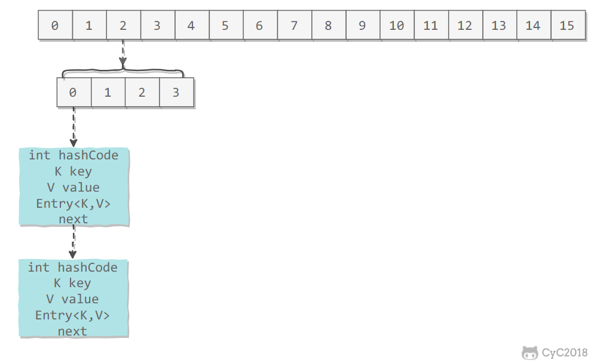
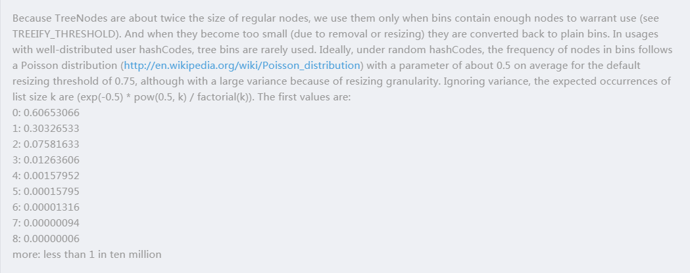

<!-- TOC -->

- [一、概览](#一概览)
    - [Collection](#collection)
        - [1. Set](#1-set)
        - [2. List](#2-list)
        - [3. Queue](#3-queue)
    - [Map](#map)
- [二、容器中的设计模式](#二容器中的设计模式)
    - [迭代器模式](#迭代器模式)
    - [适配器模式](#适配器模式)
- [三、源码分析](#三源码分析)
    - [ArrayList](#arraylist)
        - [1. 概览](#1-概览)
        - [2. 扩容](#2-扩容)
        - [3. 删除元素](#3-删除元素)
        - [4. Fail-Fast](#4-fail-fast)
        - [5. 序列化](#5-序列化)
    - [Vector](#vector)
        - [1. 同步](#1-同步)
        - [2. 与 ArrayList 的比较](#2-与-arraylist-的比较)
        - [3. 替代方案](#3-替代方案)
    - [CopyOnWriteArrayList](#copyonwritearraylist)
        - [读写分离](#读写分离)
        - [适用场景](#适用场景)
    - [LinkedList](#linkedlist)
        - [1. 概览](#1-概览-1)
        - [2. 与 ArrayList 的比较](#2-与-arraylist-的比较-1)
    - [HashMap](#hashmap)
        - [1. 存储结构](#1-存储结构)
        - [2. 拉链法的工作原理](#2-拉链法的工作原理)
        - [3. put 操作](#3-put-操作)
        - [4. 确定桶下标](#4-确定桶下标)
        - [5. 扩容-基本原理](#5-扩容-基本原理)
        - [6. 扩容-重新计算桶下标](#6-扩容-重新计算桶下标)
        - [7. 计算数组容量](#7-计算数组容量)
        - [8. 链表转红黑树](#8-链表转红黑树)
        - [9. 与 HashTable 的比较](#9-与-hashtable-的比较)
    - [ConcurrentHashMap](#concurrenthashmap)
        - [1. 存储结构](#1-存储结构-1)
        - [2. size 操作](#2-size-操作)
        - [3. JDK 1.8 的改动](#3-jdk-18-的改动)
    - [LinkedHashMap](#linkedhashmap)
        - [存储结构](#存储结构)
        - [afterNodeAccess()](#afternodeaccess)
        - [afterNodeInsertion()](#afternodeinsertion)
        - [LRU 缓存](#lru-缓存)
    - [WeakHashMap](#weakhashmap)
        - [存储结构](#存储结构-1)
        - [ConcurrentCache](#concurrentcache)
- [HashMap/HashTable/ConcurrHashMap](#hashmaphashtableconcurrhashmap)
    - [HashMap](#hashmap-1)
        - [什么是HashMap？](#什么是hashmap)
        - [HashMap的工作原理？](#hashmap的工作原理)
        - [怎样计算key在数组中的位置(hash算法)？根据HashCode计算数组下标？](#怎样计算key在数组中的位置hash算法根据hashcode计算数组下标)
        - [碰撞，hash冲突](#碰撞hash冲突)
        - [HashMap的扩容resize()？](#hashmap的扩容resize)
        - [HashMap长度为什么等于2的幂？ ？](#hashmap长度为什么等于2的幂-)
        - [JDK1.8的HashMap的优化？](#jdk18的hashmap的优化)
        - [为什么JDK1.8中HashMap链表长度超过8会转成树结构？？](#为什么jdk18中hashmap链表长度超过8会转成树结构)
        - [HashMap为什么是线程不安全的？](#hashmap为什么是线程不安全的)
        - [为什么String, Interger这样的wrapper类适合作为键？？](#为什么string-interger这样的wrapper类适合作为键)
        - [我们可以使用自定义的对象作为键吗？？](#我们可以使用自定义的对象作为键吗)
    - [HashTable](#hashtable)
        - [什么是HashTable](#什么是hashtable)
        - [HashTable的参数？](#hashtable的参数)
        - [HashTable的扩容](#hashtable的扩容)
    - [HashTable和HashMap的区别](#hashtable和hashmap的区别)
    - [ConcurrHashMap](#concurrhashmap)
        - [什么是ConcurrentHashMap?](#什么是concurrenthashmap)
        - [为什么用ConcurrentHashMap?](#为什么用concurrenthashmap)
        - [JDK1.7 ConcurrentHashMap?](#jdk17-concurrenthashmap)
            - [结构](#结构)
                - [Segment](#segment)
                - [什么是分段锁技术？](#什么是分段锁技术)
            - [ConcurrentHashMap的工作原理？](#concurrenthashmap的工作原理)
            - [初始化](#初始化)
                - [三个参数](#三个参数)
                - [初始化ConcurrentHashMap](#初始化concurrenthashmap)
                - [初始化Segment分段](#初始化segment分段)
                - [三次hash](#三次hash)
            - [Put操作？](#put操作)
            - [Get操作？](#get操作)
            - [Remove操作？](#remove操作)
            - [size操作？](#size操作)
        - [JDK1.8 ConcurrentHashMap?](#jdk18-concurrenthashmap)
            - [结构](#结构-1)
                - [CAS原理？](#cas原理)
            - [ConcurrentHashMap的工作原理？](#concurrenthashmap的工作原理-1)
            - [初始化](#初始化-1)
                - [三个参数](#三个参数-1)
                - [初始化ConcurrentHashMap](#初始化concurrenthashmap-1)
                - [初始化Segment分段](#初始化segment分段-1)
                - [三次hash](#三次hash-1)
            - [Put操作？](#put操作-1)
            - [Get操作？](#get操作-1)
            - [Remove操作？](#remove操作-1)
            - [size操作？](#size操作-1)
        - [什么是ConcurrentHashMap?](#什么是concurrenthashmap-1)
        - [什么是ConcurrentHashMap?](#什么是concurrenthashmap-2)
        - [什么是ConcurrentHashMap?](#什么是concurrenthashmap-3)
- [其他](#其他)
    - [序列化和反序列化](#序列化和反序列化)

<!-- /TOC -->

# 一、概览

容器主要包括 Collection 和 Map 两种，Collection 存储着对象的集合，而 Map 存储着键值对（两个对象）的映射表。

## Collection

<div align="center">  </div><br>

### 1. Set

- TreeSet：基于红黑树实现，支持有序性操作，例如根据一个范围查找元素的操作。但是查找效率不如 HashSet，HashSet 查找的时间复杂度为 O(1)，TreeSet 则为 O(logN)。

- HashSet：基于哈希表实现，支持快速查找，但不支持有序性操作。并且失去了元素的插入顺序信息，也就是说使用 Iterator 遍历 HashSet 得到的结果是不确定的。

- LinkedHashSet：具有 HashSet 的查找效率，且内部使用双向链表维护元素的插入顺序。

### 2. List

- ArrayList：基于动态数组实现，支持随机访问。

- Vector：和 ArrayList 类似，但它是线程安全的。

- LinkedList：基于双向链表实现，只能顺序访问，但是可以快速地在链表中间插入和删除元素。不仅如此，LinkedList 还可以用作栈、队列和双向队列。

### 3. Queue

- LinkedList：可以用它来实现双向队列。

- PriorityQueue：基于堆结构实现，可以用它来实现优先队列。

## Map

<div align="center">  </div><br>

- TreeMap：基于红黑树实现。

- HashMap：基于哈希表实现。

- HashTable：和 HashMap 类似，但它是线程安全的，这意味着同一时刻多个线程可以同时写入 HashTable 并且不会导致数据不一致。它是遗留类，不应该去使用它。现在可以使用 ConcurrentHashMap 来支持线程安全，并且 ConcurrentHashMap 的效率会更高，因为 ConcurrentHashMap 引入了分段锁。

- LinkedHashMap：使用双向链表来维护元素的顺序，顺序为插入顺序或者最近最少使用（LRU）顺序。


# 二、容器中的设计模式

## 迭代器模式

<div align="center">  </div><br>

Collection 继承了 Iterable 接口，其中的 iterator() 方法能够产生一个 Iterator 对象，通过这个对象就可以迭代遍历 Collection 中的元素。

从 JDK 1.5 之后可以使用 foreach 方法来遍历实现了 Iterable 接口的聚合对象。

```java
List<String> list = new ArrayList<>();
list.add("a");
list.add("b");
for (String item : list) {
    System.out.println(item);
}
```

## 适配器模式

java.util.Arrays#asList() 可以把数组类型转换为 List 类型。

```java
@SafeVarargs
public static <T> List<T> asList(T... a)
```

应该注意的是 asList() 的参数为泛型的变长参数，不能使用基本类型数组作为参数，只能使用相应的包装类型数组。

```java
Integer[] arr = {1, 2, 3};
List list = Arrays.asList(arr);
```

也可以使用以下方式调用 asList()：

```java
List list = Arrays.asList(1, 2, 3);
```

# 三、源码分析

如果没有特别说明，以下源码分析基于 JDK 1.8。

在 IDEA 中 double shift 调出 Search EveryWhere，查找源码文件，找到之后就可以阅读源码。

## ArrayList


### 1. 概览

因为 ArrayList 是基于数组实现的，所以支持快速随机访问。RandomAccess 接口标识着该类支持快速随机访问。

```java
public class ArrayList<E> extends AbstractList<E>
        implements List<E>, RandomAccess, Cloneable, java.io.Serializable
```

数组的默认大小为 10。

```java
private static final int DEFAULT_CAPACITY = 10;
```

<div align="center">  </div><br>

### 2. 扩容

添加元素时使用 ensureCapacityInternal() 方法来保证容量足够，如果不够时，需要使用 grow() 方法进行扩容，新容量的大小为 `oldCapacity + (oldCapacity >> 1)`，也就是旧容量的 1.5 倍。

扩容操作需要调用 `Arrays.copyOf()` 把原数组整个复制到新数组中，这个操作代价很高，因此最好在创建 ArrayList 对象时就指定大概的容量大小，减少扩容操作的次数。

```java
public boolean add(E e) {
    ensureCapacityInternal(size + 1);  // Increments modCount!!
    elementData[size++] = e;
    return true;
}

private void ensureCapacityInternal(int minCapacity) {
    if (elementData == DEFAULTCAPACITY_EMPTY_ELEMENTDATA) {
        minCapacity = Math.max(DEFAULT_CAPACITY, minCapacity);
    }
    ensureExplicitCapacity(minCapacity);
}

private void ensureExplicitCapacity(int minCapacity) {
    modCount++;
    // overflow-conscious code
    if (minCapacity - elementData.length > 0)
        grow(minCapacity);
}

private void grow(int minCapacity) {
    // overflow-conscious code
    int oldCapacity = elementData.length;
    int newCapacity = oldCapacity + (oldCapacity >> 1);
    if (newCapacity - minCapacity < 0)
        newCapacity = minCapacity;
    if (newCapacity - MAX_ARRAY_SIZE > 0)
        newCapacity = hugeCapacity(minCapacity);
    // minCapacity is usually close to size, so this is a win:
    elementData = Arrays.copyOf(elementData, newCapacity);
}
```

### 3. 删除元素

需要调用 System.arraycopy() 将 index+1 后面的元素都复制到 index 位置上，该操作的时间复杂度为 O(N)，可以看出 ArrayList 删除元素的代价是非常高的。

```java
public E remove(int index) {
    rangeCheck(index);
    modCount++;
    E oldValue = elementData(index);
    int numMoved = size - index - 1;
    if (numMoved > 0)
        System.arraycopy(elementData, index+1, elementData, index, numMoved);
    elementData[--size] = null; // clear to let GC do its work
    return oldValue;
}
```

### 4. Fail-Fast

modCount 用来记录 ArrayList 结构发生变化的次数。结构发生变化是指添加或者删除至少一个元素的所有操作，或者是调整内部数组的大小，仅仅只是设置元素的值不算结构发生变化。

在进行序列化或者迭代等操作时，需要比较操作前后 modCount 是否改变，如果改变了需要抛出 ConcurrentModificationException。

```java
private void writeObject(java.io.ObjectOutputStream s)
    throws java.io.IOException{
    // Write out element count, and any hidden stuff
    int expectedModCount = modCount;
    s.defaultWriteObject();

    // Write out size as capacity for behavioural compatibility with clone()
    s.writeInt(size);

    // Write out all elements in the proper order.
    for (int i=0; i<size; i++) {
        s.writeObject(elementData[i]);
    }

    if (modCount != expectedModCount) {
        throw new ConcurrentModificationException();
    }
}
```

### 5. 序列化

ArrayList 基于数组实现，并且具有动态扩容特性，因此保存元素的数组不一定都会被使用，那么就没必要全部进行序列化。

保存元素的数组 elementData 使用 transient 修饰，该关键字声明数组默认不会被序列化。

```java
transient Object[] elementData; // non-private to simplify nested class access
```

ArrayList 实现了 writeObject() 和 readObject() 来控制只序列化数组中有元素填充那部分内容。

```java
private void readObject(java.io.ObjectInputStream s)
    throws java.io.IOException, ClassNotFoundException {
    elementData = EMPTY_ELEMENTDATA;

    // Read in size, and any hidden stuff
    s.defaultReadObject();

    // Read in capacity
    s.readInt(); // ignored

    if (size > 0) {
        // be like clone(), allocate array based upon size not capacity
        ensureCapacityInternal(size);

        Object[] a = elementData;
        // Read in all elements in the proper order.
        for (int i=0; i<size; i++) {
            a[i] = s.readObject();
        }
    }
}
```

```java
private void writeObject(java.io.ObjectOutputStream s)
    throws java.io.IOException{
    // Write out element count, and any hidden stuff
    int expectedModCount = modCount;
    s.defaultWriteObject();

    // Write out size as capacity for behavioural compatibility with clone()
    s.writeInt(size);

    // Write out all elements in the proper order.
    for (int i=0; i<size; i++) {
        s.writeObject(elementData[i]);
    }

    if (modCount != expectedModCount) {
        throw new ConcurrentModificationException();
    }
}
```

序列化时需要使用 ObjectOutputStream 的 writeObject() 将对象转换为字节流并输出。而 writeObject() 方法在传入的对象存在 writeObject() 的时候会去反射调用该对象的 writeObject() 来实现序列化。反序列化使用的是 ObjectInputStream 的 readObject() 方法，原理类似。

```java
ArrayList list = new ArrayList();
ObjectOutputStream oos = new ObjectOutputStream(new FileOutputStream(file));
oos.writeObject(list);
```

## Vector

### 1. 同步

它的实现与 ArrayList 类似，但是使用了 synchronized 进行同步。

```java
public synchronized boolean add(E e) {
    modCount++;
    ensureCapacityHelper(elementCount + 1);
    elementData[elementCount++] = e;
    return true;
}

public synchronized E get(int index) {
    if (index >= elementCount)
        throw new ArrayIndexOutOfBoundsException(index);

    return elementData(index);
}
```

### 2. 与 ArrayList 的比较

- Vector 是同步的，因此开销就比 ArrayList 要大，访问速度更慢。最好使用 ArrayList 而不是 Vector，因为同步操作完全可以由程序员自己来控制；
- Vector 每次扩容请求其大小的 2 倍空间，而 ArrayList 是 1.5 倍。

### 3. 替代方案

可以使用 `Collections.synchronizedList();` 得到一个线程安全的 ArrayList。

```java
List<String> list = new ArrayList<>();
List<String> synList = Collections.synchronizedList(list);
```

也可以使用 concurrent 并发包下的 CopyOnWriteArrayList 类。

```java
List<String> list = new CopyOnWriteArrayList<>();
```

## CopyOnWriteArrayList

### 读写分离

写操作在一个复制的数组上进行，读操作还是在原始数组中进行，读写分离，互不影响。

写操作需要加锁，防止并发写入时导致写入数据丢失。

写操作结束之后需要把原始数组指向新的复制数组。

```java
public boolean add(E e) {
    final ReentrantLock lock = this.lock;
    lock.lock();
    try {
        Object[] elements = getArray();
        int len = elements.length;
        Object[] newElements = Arrays.copyOf(elements, len + 1);
        newElements[len] = e;
        setArray(newElements);
        return true;
    } finally {
        lock.unlock();
    }
}

final void setArray(Object[] a) {
    array = a;
}
```

```java
@SuppressWarnings("unchecked")
private E get(Object[] a, int index) {
    return (E) a[index];
}
```

### 适用场景

CopyOnWriteArrayList 在写操作的同时允许读操作，大大提高了读操作的性能，因此很适合读多写少的应用场景。

但是 CopyOnWriteArrayList 有其缺陷：

- 内存占用：在写操作时需要复制一个新的数组，使得内存占用为原来的两倍左右；
- 数据不一致：读操作不能读取实时性的数据，因为部分写操作的数据还未同步到读数组中。

所以 CopyOnWriteArrayList 不适合内存敏感以及对实时性要求很高的场景。

## LinkedList

### 1. 概览

基于双向链表实现，使用 Node 存储链表节点信息。

```java
private static class Node<E> {
    E item;
    Node<E> next;
    Node<E> prev;
}
```

每个链表存储了 first 和 last 指针：

```java
transient Node<E> first;
transient Node<E> last;
```

<div align="center">  </div><br>

### 2. 与 ArrayList 的比较

- ArrayList 基于动态数组实现，LinkedList 基于双向链表实现；
- ArrayList 支持随机访问，LinkedList 不支持；
- LinkedList 在任意位置添加删除元素更快。

## HashMap

为了便于理解，以下源码分析以 JDK 1.7 为主。

### 1. 存储结构

内部包含了一个 Entry 类型的数组 table。

```java
transient Entry[] table;
```

Entry 存储着键值对。它包含了四个字段，从 next 字段我们可以看出 Entry 是一个链表。即数组中的每个位置被当成一个桶，一个桶存放一个链表。HashMap 使用拉链法来解决冲突，同一个链表中存放哈希值和散列桶取模运算结果相同的 Entry。

<div align="center">  </div><br>

```java
static class Entry<K,V> implements Map.Entry<K,V> {
    final K key;
    V value;
    Entry<K,V> next;
    int hash;

    Entry(int h, K k, V v, Entry<K,V> n) {
        value = v;
        next = n;
        key = k;
        hash = h;
    }

    public final K getKey() {
        return key;
    }

    public final V getValue() {
        return value;
    }

    public final V setValue(V newValue) {
        V oldValue = value;
        value = newValue;
        return oldValue;
    }

    public final boolean equals(Object o) {
        if (!(o instanceof Map.Entry))
            return false;
        Map.Entry e = (Map.Entry)o;
        Object k1 = getKey();
        Object k2 = e.getKey();
        if (k1 == k2 || (k1 != null && k1.equals(k2))) {
            Object v1 = getValue();
            Object v2 = e.getValue();
            if (v1 == v2 || (v1 != null && v1.equals(v2)))
                return true;
        }
        return false;
    }

    public final int hashCode() {
        return Objects.hashCode(getKey()) ^ Objects.hashCode(getValue());
    }

    public final String toString() {
        return getKey() + "=" + getValue();
    }
}
```

### 2. 拉链法的工作原理

```java
HashMap<String, String> map = new HashMap<>();
map.put("K1", "V1");
map.put("K2", "V2");
map.put("K3", "V3");
```

- 新建一个 HashMap，默认大小为 16；
- 插入 &lt;K1,V1> 键值对，先计算 K1 的 hashCode 为 115，使用除留余数法得到所在的桶下标 115%16=3。
- 插入 &lt;K2,V2> 键值对，先计算 K2 的 hashCode 为 118，使用除留余数法得到所在的桶下标 118%16=6。
- 插入 &lt;K3,V3> 键值对，先计算 K3 的 hashCode 为 118，使用除留余数法得到所在的桶下标 118%16=6，插在 &lt;K2,V2> 前面。

应该注意到链表的插入是以头插法方式进行的，例如上面的 &lt;K3,V3> 不是插在 &lt;K2,V2> 后面，而是插入在链表头部。

查找需要分成两步进行：

- 计算键值对所在的桶；
- 在链表上顺序查找，时间复杂度显然和链表的长度成正比。

<div align="center">  </div><br>

### 3. put 操作

```java
public V put(K key, V value) {
    if (table == EMPTY_TABLE) {
        inflateTable(threshold);
    }
    // 键为 null 单独处理
    if (key == null)
        return putForNullKey(value);
    int hash = hash(key);
    // 确定桶下标
    int i = indexFor(hash, table.length);
    // 先找出是否已经存在键为 key 的键值对，如果存在的话就更新这个键值对的值为 value
    for (Entry<K,V> e = table[i]; e != null; e = e.next) {
        Object k;
        if (e.hash == hash && ((k = e.key) == key || key.equals(k))) {
            V oldValue = e.value;
            e.value = value;
            e.recordAccess(this);
            return oldValue;
        }
    }

    modCount++;
    // 插入新键值对
    addEntry(hash, key, value, i);
    return null;
}
```

HashMap 允许插入键为 null 的键值对。但是因为无法调用 null 的 hashCode() 方法，也就无法确定该键值对的桶下标，只能通过强制指定一个桶下标来存放。HashMap 使用第 0 个桶存放键为 null 的键值对。

```java
private V putForNullKey(V value) {
    for (Entry<K,V> e = table[0]; e != null; e = e.next) {
        if (e.key == null) {
            V oldValue = e.value;
            e.value = value;
            e.recordAccess(this);
            return oldValue;
        }
    }
    modCount++;
    addEntry(0, null, value, 0);
    return null;
}
```

使用链表的头插法，也就是新的键值对插在链表的头部，而不是链表的尾部。

```java
void addEntry(int hash, K key, V value, int bucketIndex) {
    if ((size >= threshold) && (null != table[bucketIndex])) {
        resize(2 * table.length);
        hash = (null != key) ? hash(key) : 0;
        bucketIndex = indexFor(hash, table.length);
    }

    createEntry(hash, key, value, bucketIndex);
}

void createEntry(int hash, K key, V value, int bucketIndex) {
    Entry<K,V> e = table[bucketIndex];
    // 头插法，链表头部指向新的键值对
    table[bucketIndex] = new Entry<>(hash, key, value, e);
    size++;
}
```

```java
Entry(int h, K k, V v, Entry<K,V> n) {
    value = v;
    next = n;
    key = k;
    hash = h;
}
```

### 4. 确定桶下标

很多操作都需要先确定一个键值对所在的桶下标。

```java
int hash = hash(key);
int i = indexFor(hash, table.length);
```

**4.1 计算 hash 值** 

```java
final int hash(Object k) {
    int h = hashSeed;
    if (0 != h && k instanceof String) {
        return sun.misc.Hashing.stringHash32((String) k);
    }

    h ^= k.hashCode();

    // This function ensures that hashCodes that differ only by
    // constant multiples at each bit position have a bounded
    // number of collisions (approximately 8 at default load factor).
    h ^= (h >>> 20) ^ (h >>> 12);
    return h ^ (h >>> 7) ^ (h >>> 4);
}
```

```java
public final int hashCode() {
    return Objects.hashCode(key) ^ Objects.hashCode(value);
}
```

**4.2 取模** 

令 x = 1<<4，即 x 为 2 的 4 次方，它具有以下性质：

```
x   : 00010000
x-1 : 00001111
```

令一个数 y 与 x-1 做与运算，可以去除 y 位级表示的第 4 位以上数：

```
y       : 10110010
x-1     : 00001111
y&(x-1) : 00000010
```

这个性质和 y 对 x 取模效果是一样的：

```
y   : 10110010
x   : 00010000
y%x : 00000010
```

我们知道，位运算的代价比求模运算小的多，因此在进行这种计算时用位运算的话能带来更高的性能。

确定桶下标的最后一步是将 key 的 hash 值对桶个数取模：hash%capacity，如果能保证 capacity 为 2 的 n 次方，那么就可以将这个操作转换为位运算。

```java
static int indexFor(int h, int length) {
    return h & (length-1);
}
```

### 5. 扩容-基本原理

设 HashMap 的 table 长度为 M，需要存储的键值对数量为 N，如果哈希函数满足均匀性的要求，那么每条链表的长度大约为 N/M，因此平均查找次数的复杂度为 O(N/M)。

为了让查找的成本降低，应该尽可能使得 N/M 尽可能小，因此需要保证 M 尽可能大，也就是说 table 要尽可能大。HashMap 采用动态扩容来根据当前的 N 值来调整 M 值，使得空间效率和时间效率都能得到保证。

和扩容相关的参数主要有：capacity、size、threshold 和 load_factor。

| 参数 | 含义 |
| :--: | :-- |
| capacity | table 的容量大小，默认为 16。需要注意的是 capacity 必须保证为 2 的 n 次方。|
| size | 键值对数量。 |
| threshold | size 的临界值，当 size 大于等于 threshold 就必须进行扩容操作。 |
| loadFactor | 装载因子，table 能够使用的比例，threshold = capacity * loadFactor。|

```java
static final int DEFAULT_INITIAL_CAPACITY = 16;

static final int MAXIMUM_CAPACITY = 1 << 30;

static final float DEFAULT_LOAD_FACTOR = 0.75f;

transient Entry[] table;

transient int size;

int threshold;

final float loadFactor;

transient int modCount;
```

从下面的添加元素代码中可以看出，当需要扩容时，令 capacity 为原来的两倍。

```java
void addEntry(int hash, K key, V value, int bucketIndex) {
    Entry<K,V> e = table[bucketIndex];
    table[bucketIndex] = new Entry<>(hash, key, value, e);
    if (size++ >= threshold)
        resize(2 * table.length);
}
```

扩容使用 resize() 实现，需要注意的是，扩容操作同样需要把 oldTable 的所有键值对重新插入 newTable 中，因此这一步是很费时的。

```java
void resize(int newCapacity) {
    Entry[] oldTable = table;
    int oldCapacity = oldTable.length;
    if (oldCapacity == MAXIMUM_CAPACITY) {
        threshold = Integer.MAX_VALUE;
        return;
    }
    Entry[] newTable = new Entry[newCapacity];
    transfer(newTable);
    table = newTable;
    threshold = (int)(newCapacity * loadFactor);
}

void transfer(Entry[] newTable) {
    Entry[] src = table;
    int newCapacity = newTable.length;
    for (int j = 0; j < src.length; j++) {
        Entry<K,V> e = src[j];
        if (e != null) {
            src[j] = null;
            do {
                Entry<K,V> next = e.next;
                int i = indexFor(e.hash, newCapacity);
                e.next = newTable[i];
                newTable[i] = e;
                e = next;
            } while (e != null);
        }
    }
}
```

### 6. 扩容-重新计算桶下标

在进行扩容时，需要把键值对重新放到对应的桶上。HashMap 使用了一个特殊的机制，可以降低重新计算桶下标的操作。

假设原数组长度 capacity 为 16，扩容之后 new capacity 为 32：

```html
capacity     : 00010000
new capacity : 00100000
```

对于一个 Key，

- 它的哈希值如果在第 5 位上为 0，那么取模得到的结果和之前一样；
- 如果为 1，那么得到的结果为原来的结果 +16。

### 7. 计算数组容量

HashMap 构造函数允许用户传入的容量不是 2 的 n 次方，因为它可以自动地将传入的容量转换为 2 的 n 次方。

先考虑如何求一个数的掩码，对于 10010000，它的掩码为 11111111，可以使用以下方法得到：

```
mask |= mask >> 1    11011000
mask |= mask >> 2    11111110
mask |= mask >> 4    11111111
```

mask+1 是大于原始数字的最小的 2 的 n 次方。

```
num     10010000
mask+1 100000000
```

以下是 HashMap 中计算数组容量的代码：

```java
static final int tableSizeFor(int cap) {
    int n = cap - 1;
    n |= n >>> 1;
    n |= n >>> 2;
    n |= n >>> 4;
    n |= n >>> 8;
    n |= n >>> 16;
    return (n < 0) ? 1 : (n >= MAXIMUM_CAPACITY) ? MAXIMUM_CAPACITY : n + 1;
}
```

### 8. 链表转红黑树

从 JDK 1.8 开始，一个桶存储的链表长度大于 8 时会将链表转换为红黑树。

### 9. 与 HashTable 的比较

- HashTable 使用 synchronized 来进行同步。
- HashMap 可以插入键为 null 的 Entry。
- HashMap 的迭代器是 fail-fast 迭代器。
- HashMap 不能保证随着时间的推移 Map 中的元素次序是不变的。

## ConcurrentHashMap

### 1. 存储结构

```java
static final class HashEntry<K,V> {
    final int hash;
    final K key;
    volatile V value;
    volatile HashEntry<K,V> next;
}
```

ConcurrentHashMap 和 HashMap 实现上类似，最主要的差别是 ConcurrentHashMap 采用了分段锁（Segment），每个分段锁维护着几个桶（HashEntry），多个线程可以同时访问不同分段锁上的桶，从而使其并发度更高（并发度就是 Segment 的个数）。

Segment 继承自 ReentrantLock。

```java
static final class Segment<K,V> extends ReentrantLock implements Serializable {

    private static final long serialVersionUID = 2249069246763182397L;

    static final int MAX_SCAN_RETRIES =
        Runtime.getRuntime().availableProcessors() > 1 ? 64 : 1;

    transient volatile HashEntry<K,V>[] table;

    transient int count;

    transient int modCount;

    transient int threshold;

    final float loadFactor;
}
```

```java
final Segment<K,V>[] segments;
```

默认的并发级别为 16，也就是说默认创建 16 个 Segment。

```java
static final int DEFAULT_CONCURRENCY_LEVEL = 16;
```

<div align="center">  </div><br>

### 2. size 操作

每个 Segment 维护了一个 count 变量来统计该 Segment 中的键值对个数。

```java
/**
 * The number of elements. Accessed only either within locks
 * or among other volatile reads that maintain visibility.
 */
transient int count;
```

在执行 size 操作时，需要遍历所有 Segment 然后把 count 累计起来。

ConcurrentHashMap 在执行 size 操作时先尝试不加锁，如果连续两次不加锁操作得到的结果一致，那么可以认为这个结果是正确的。

尝试次数使用 RETRIES_BEFORE_LOCK 定义，该值为 2，retries 初始值为 -1，因此尝试次数为 3。

如果尝试的次数超过 3 次，就需要对每个 Segment 加锁。

```java

/**
 * Number of unsynchronized retries in size and containsValue
 * methods before resorting to locking. This is used to avoid
 * unbounded retries if tables undergo continuous modification
 * which would make it impossible to obtain an accurate result.
 */
static final int RETRIES_BEFORE_LOCK = 2;

public int size() {
    // Try a few times to get accurate count. On failure due to
    // continuous async changes in table, resort to locking.
    final Segment<K,V>[] segments = this.segments;
    int size;
    boolean overflow; // true if size overflows 32 bits
    long sum;         // sum of modCounts
    long last = 0L;   // previous sum
    int retries = -1; // first iteration isn't retry
    try {
        for (;;) {
            // 超过尝试次数，则对每个 Segment 加锁
            if (retries++ == RETRIES_BEFORE_LOCK) {
                for (int j = 0; j < segments.length; ++j)
                    ensureSegment(j).lock(); // force creation
            }
            sum = 0L;
            size = 0;
            overflow = false;
            for (int j = 0; j < segments.length; ++j) {
                Segment<K,V> seg = segmentAt(segments, j);
                if (seg != null) {
                    sum += seg.modCount;
                    int c = seg.count;
                    if (c < 0 || (size += c) < 0)
                        overflow = true;
                }
            }
            // 连续两次得到的结果一致，则认为这个结果是正确的
            if (sum == last)
                break;
            last = sum;
        }
    } finally {
        if (retries > RETRIES_BEFORE_LOCK) {
            for (int j = 0; j < segments.length; ++j)
                segmentAt(segments, j).unlock();
        }
    }
    return overflow ? Integer.MAX_VALUE : size;
}
```

### 3. JDK 1.8 的改动

JDK 1.7 使用分段锁机制来实现并发更新操作，核心类为 Segment，它继承自重入锁 ReentrantLock，并发度与 Segment 数量相等。

JDK 1.8 使用了 CAS 操作来支持更高的并发度，在 CAS 操作失败时使用内置锁 synchronized。

并且 JDK 1.8 的实现也在链表过长时会转换为红黑树。

## LinkedHashMap

### 存储结构

继承自 HashMap，因此具有和 HashMap 一样的快速查找特性。

```java
public class LinkedHashMap<K,V> extends HashMap<K,V> implements Map<K,V>
```

内部维护了一个双向链表，用来维护插入顺序或者 LRU 顺序。

```java
/**
 * The head (eldest) of the doubly linked list.
 */
transient LinkedHashMap.Entry<K,V> head;

/**
 * The tail (youngest) of the doubly linked list.
 */
transient LinkedHashMap.Entry<K,V> tail;
```

accessOrder 决定了顺序，默认为 false，此时维护的是插入顺序。

```java
final boolean accessOrder;
```

LinkedHashMap 最重要的是以下用于维护顺序的函数，它们会在 put、get 等方法中调用。

```java
void afterNodeAccess(Node<K,V> p) { }
void afterNodeInsertion(boolean evict) { }
```

### afterNodeAccess()

当一个节点被访问时，如果 accessOrder 为 true，则会将该节点移到链表尾部。也就是说指定为 LRU 顺序之后，在每次访问一个节点时，会将这个节点移到链表尾部，保证链表尾部是最近访问的节点，那么链表首部就是最近最久未使用的节点。

```java
void afterNodeAccess(Node<K,V> e) { // move node to last
    LinkedHashMap.Entry<K,V> last;
    if (accessOrder && (last = tail) != e) {
        LinkedHashMap.Entry<K,V> p =
            (LinkedHashMap.Entry<K,V>)e, b = p.before, a = p.after;
        p.after = null;
        if (b == null)
            head = a;
        else
            b.after = a;
        if (a != null)
            a.before = b;
        else
            last = b;
        if (last == null)
            head = p;
        else {
            p.before = last;
            last.after = p;
        }
        tail = p;
        ++modCount;
    }
}
```

### afterNodeInsertion()

在 put 等操作之后执行，当 removeEldestEntry() 方法返回 true 时会移除最晚的节点，也就是链表首部节点 first。

evict 只有在构建 Map 的时候才为 false，在这里为 true。

```java
void afterNodeInsertion(boolean evict) { // possibly remove eldest
    LinkedHashMap.Entry<K,V> first;
    if (evict && (first = head) != null && removeEldestEntry(first)) {
        K key = first.key;
        removeNode(hash(key), key, null, false, true);
    }
}
```

removeEldestEntry() 默认为 false，如果需要让它为 true，需要继承 LinkedHashMap 并且覆盖这个方法的实现，这在实现 LRU 的缓存中特别有用，通过移除最近最久未使用的节点，从而保证缓存空间足够，并且缓存的数据都是热点数据。

```java
protected boolean removeEldestEntry(Map.Entry<K,V> eldest) {
    return false;
}
```

### LRU 缓存

以下是使用 LinkedHashMap 实现的一个 LRU 缓存：

- 设定最大缓存空间 MAX_ENTRIES  为 3；
- 使用 LinkedHashMap 的构造函数将 accessOrder 设置为 true，开启 LRU 顺序；
- 覆盖 removeEldestEntry() 方法实现，在节点多于 MAX_ENTRIES 就会将最近最久未使用的数据移除。

```java
class LRUCache<K, V> extends LinkedHashMap<K, V> {
    private static final int MAX_ENTRIES = 3;

    protected boolean removeEldestEntry(Map.Entry eldest) {
        return size() > MAX_ENTRIES;
    }

    LRUCache() {
        super(MAX_ENTRIES, 0.75f, true);
    }
}
```

```java
public static void main(String[] args) {
    LRUCache<Integer, String> cache = new LRUCache<>();
    cache.put(1, "a");
    cache.put(2, "b");
    cache.put(3, "c");
    cache.get(1);
    cache.put(4, "d");
    System.out.println(cache.keySet());
}
```

```html
[3, 1, 4]
```

## WeakHashMap

### 存储结构

WeakHashMap 的 Entry 继承自 WeakReference，被 WeakReference 关联的对象在下一次垃圾回收时会被回收。

WeakHashMap 主要用来实现缓存，通过使用 WeakHashMap 来引用缓存对象，由 JVM 对这部分缓存进行回收。

```java
private static class Entry<K,V> extends WeakReference<Object> implements Map.Entry<K,V>
```

### ConcurrentCache

Tomcat 中的 ConcurrentCache 使用了 WeakHashMap 来实现缓存功能。

ConcurrentCache 采取的是分代缓存：

- 经常使用的对象放入 eden 中，eden 使用 ConcurrentHashMap 实现，不用担心会被回收（伊甸园）；
- 不常用的对象放入 longterm，longterm 使用 WeakHashMap 实现，这些老对象会被垃圾收集器回收。
- 当调用  get() 方法时，会先从 eden 区获取，如果没有找到的话再到 longterm 获取，当从 longterm 获取到就把对象放入 eden 中，从而保证经常被访问的节点不容易被回收。
- 当调用 put() 方法时，如果 eden 的大小超过了 size，那么就将 eden 中的所有对象都放入 longterm 中，利用虚拟机回收掉一部分不经常使用的对象。

```java
public final class ConcurrentCache<K, V> {

    private final int size;

    private final Map<K, V> eden;

    private final Map<K, V> longterm;

    public ConcurrentCache(int size) {
        this.size = size;
        this.eden = new ConcurrentHashMap<>(size);
        this.longterm = new WeakHashMap<>(size);
    }

    public V get(K k) {
        V v = this.eden.get(k);
        if (v == null) {
            v = this.longterm.get(k);
            if (v != null)
                this.eden.put(k, v);
        }
        return v;
    }

    public void put(K k, V v) {
        if (this.eden.size() >= size) {
            this.longterm.putAll(this.eden);
            this.eden.clear();
        }
        this.eden.put(k, v);
    }
}
```

# HashMap/HashTable/ConcurrHashMap

## HashMap

### 什么是HashMap？

- 基于哈希表的 Map 接口的实现。
- HashMap 是一个散列表，它存储的内容是键值对(key-value)映射。
- HashMap 继承于AbstractMap，实现了Map、Cloneable、java.io.Serializable接口。
- HashMap 的实现不是同步的，这意味着它不是线程安全的。它的key、value都可以为null。此外，HashMap中的映射不是有序的。

### HashMap的工作原理？

- HashMap是基于hashing的原理，我们使用put(key, value)存储对象到HashMap中，使用get(key)从HashMap中获取对象。
	- Put: 当我们往hashmap中put元素的时候，先根据key的hash值得到这个元素在数组中的位置（即下标），如果下标对应的链表为空，则直接把键值对作为链表头节点，如果不为空，发生哈希冲突，则equals方法在对应位置的链表中找到需要的元素，有就把value替换，没有那么在同一个位子上的元素将以链表的形式存放，新加入的放在链头，最先加入的放在链尾。（JDK1.7之所以放在头节点，是因为HashMap的发明者认为后插入的Entry被查找的可能性更大。）

	- Get: 从hashmap中get元素时，首先计算key的hashcode，找到数组中对应位置的某一元素，然后通过key的equals方法在对应位置的链表中找到需要的元素。

### 怎样计算key在数组中的位置(hash算法)？根据HashCode计算数组下标？

- 我们当然希望这个hashmap里面的元素位置尽量的分布均匀些，尽量使得每个位置上的元素数量只有一个，那么当我们用hash算法求得这个位置的时候，马上就可以知道对应位置的元素就是我们要的，而不用再去遍历链表

- JDK1.7
    -  h&(length-1) 就相当于对length取模，而且在速度、效率上比直接取模要快得多

- JDK1.8优化
    - 高16位异或低16位，然后再h&(length-1)，目的：混合原始哈希码的高位和低位，以此来加大低位的随机性。而且混合后的低位掺杂了高位的部分特征，这样高位的信息也被变相保留下来。
    - <div align="left">  </div><br>

### 碰撞，hash冲突

- 哈希表为解决 Hash 冲突，可以采用开放地址法和链地址法来解决问题。HashMap 采用了链地址法。链地址法，简单来说，就是数组加链表的结合。在每个数组元素上都一个链表结构，当数据被 Hash 后，得到数组下标，把数据放在对应下标元素的链表上。
- JDK1.7 链表头插。JDK1.8 链表尾插。

### HashMap的扩容resize()？

- JDK 1.7   先扩容后插入
	- hashmap使用一个容量更大的数组来代替旧的数组，transfer（）方法将原有Entry数组里的元素拷贝到新的Entry数组里，扩容之后，原数组中的数据必须重新计算其在新数组中的位置，并放进去，这就是resize。
    - 新容量=旧容量*2；默认旧容量=16*0.75=12
	- 在扩容后插入的过程中，存储在LinkedList中的元素的次序会反过来，因为移动到新的bucket位置的时候，HashMap并不会将元素放在LinkedList的尾部，而是放在头部，这是为了避免尾部遍历(tail traversing)。
- JDK 1.8   先插入后扩容
	- 在JDK1.8的时候直接用了JDK1.7的时候计算的规律，也就是扩容前的原始位置+扩容的大小值=JDK1.8的计算方式，而不再是JDK1.7的那种与计算的方法。但是这种方式就相当于只需要判断Hash值的新增参与运算的位是0还是1就直接迅速计算出了扩容后的储存方式。
    - <div align="left">  </div><br>

- JDK 1.7/1.8扩容区别 
    - <div align="left">  </div><br>  

### HashMap长度为什么等于2的幂？ ？

- hashmap中默认的数组大小为16，加载因子0.75。并且每次自动扩展或手动初始化时，长度必须是2的幂。
-  举例：
    - 看下图，左边两组是数组长度为16（2的4次方），右边两组是数组长度为15。两组的hashcode均为8和9，但是很明显，当它们和1110“与”的时候，产生了相同的结果，也就是说它们会定位到数组中的同一个位置上去，这就产生了碰撞，8和9会被放到同一个链表上，那么查询的时候就需要遍历这个链表，得到8或者9，这样就降低了查询的效率。
	- 同时，我们也可以发现，当数组长度为15的时候，hashcode的值会与14（1110）进行“与”，那么最后一位永远是0，而0001，0011，0101，1001，1011，0111，1101这几个位置永远都不能存放元素了，显然不符合Hash算法均匀分布的原则，空间浪费相当大，更糟的是这种情况中，数组可以使用的位置比数组长度小了很多，这意味着进一步增加了碰撞的几率，减慢了查询的效率！
    - <div align="left">  </div><br>  
- 所以，长度16或者其他2的幂，Length-1的值是所有二进制位全为1，这种情况下，index的结果等同于HashCode后几位的值。只要输入的HashCode本身分布均匀，Hash算法的结果就是均匀的。

### JDK1.8的HashMap的优化？

- 数据结构变化：
    - 数组+链表+红黑树，当链表的深度达到8的时候，也就是默认阈值，就会自动扩容把链表转成红黑树的数据结构来把时间复杂度从O（N）变成O（logN）提高了效率
- Hash算法计算方式改变：
    - 高16位异或低16位，后&(length-1)
- 扩容后不是重新计算所有元素在数组的位置：   
    - 新的位置=旧的位置   OR   旧的位置+旧容量
- JDK1.7用的是头插法，而JDK1.8及之后使用的都是尾插法，
	- 因为JDK1.7是用单链表进行的纵向延伸，当采用头插法就是能够提高插入的效率，但是也会容易出现逆序且环形链表死循环问题。但是在JDK1.8之后是因为加入了红黑树，使用尾插法能够避免出现逆序且链表死循环的问题。
- 链表死循环问题 https://coolshell.cn/articles/9606.html/comment-page-1#comments

### 为什么JDK1.8中HashMap链表长度超过8会转成树结构？？

- 1.若桶中链表元素个数大于等于8时，链表转换成树结构；若桶中链表元素个数小于等于6时，树结构还原成链表。因为红黑树的平均查找长度是log(n)，长度为8的时候，平均查找长度为3，如果继续使用链表，平均查找长度为8/2=4，这才有转换为树的必要。链表长度如果是小于等于6，6/2=3，虽然速度也很快的，但是转化为树结构和生成树的时间并不会太短。
- 2.还有选择6和8，中间有个差值7可以有效防止链表和树频繁转换。假设一下，如果设计成链表个数超过8则链表转换成树结构，链表个数小于8则树结构转换成链表，如果一个HashMap不停的插入、删除元素，链表个数在8左右徘徊，就会频繁的发生树转链表、链表转树，效率会很低。
- 3. 在这里简单解释一下，理想情况下，在随机哈希代码下，桶中的节点频率遵循泊松分布，文中给出了桶长度k的频率表。由频率表可以看出，桶的长度超过8的概率非常非常小。所以作者应该是根据概率统计而选择了8作为阀值，由此可见，这个选择是非常严谨和科学的。
- <div align="left">  </div><br>  

### HashMap为什么是线程不安全的？

- HashMap resize而引起死循环.（条件竞争）。扩容的的时候可能会形成环形链表， 造成死循环. https://coolshell.cn/articles/9606.html/comment-page-1#comments
- put的时候导致的多线程数据不一致
    - 在多线程下put操作时,产生哈希碰撞，最后的写入操作会覆盖先前的写入操作----写入不一致。最后的修改操作会覆盖先前的修改---修改不一致。
- 注意：要想实现线程安全，那么需要调用 collections 类的静态方法

### 为什么String, Interger这样的wrapper类适合作为键？？

- 1.不可变性： String是不可变的，也是final的
    - 计算hashCode()，就要防止键值改变，如果键值在放入时和获取时返回不同的hashcode的话，那么就不能从HashMap中找到你想要的对象。
    - 不可变性还有其他的优点如线程安全。

- 2.已经重写了equals()和hashCode()方法
    - 为什么要重写equals()方法？
        - 1．Object类中equals方法比较的是两个对象的引用地址，只有对象的引用地址指向同一个地址时，才认为这两个地址是相等的，否则这两个对象就不相等。
	    - 2.如果有两个对象，他们的属性是相同的，但是地址不同，这样使用equals()比较得出的结果是不相等的，而我们需要的是这两个对象相等，因此默认的equals()方法是不符合我们的要求的，这个时候我们就需要对equals()方法进行重写以满足我们的预期结果。
        - 3.在java的集合框架中需要用到equals()方法进行查找对象，如果集合中存放的是自定义类型，并且没有重写equals()方法，则会调用Object父类中的equals()方法按照地址比较，往往会出现错误的结果，此时我们应该根据业务需求重写equals()方法。
        - 如果不重写equals，那么比较的将是对象的引用是否指向同一块内存地址，重写之后目的是为了比较两个对象的value值是否相等。

    - 为什么java中在重写equals()方法后必须对hashCode()方法进行重写？
        - 1.为了维护hashCode()方法的equals协定，该协定指出：相等的对象必须具有相等的散列码（hashCode）；而两个hashCode()返回的结果相等，两个对象的equals()方法不一定相等。
	    - 2.如果不重写hashCode()，就会造成相等对象，不同的hashCode();在hashMap中就会存储两个值一样的对象。导致混淆。


### 我们可以使用自定义的对象作为键吗？？

- 当然你可能使用任何对象作为键，只要它遵守了equals()和hashCode()方法的定义规则，并且当对象插入到Map中之后将不会再改变了。如果这个自定义对象时不可变的，那么它已经满足了作为键的条件，因为当它创建之后就已经不能改变了。

## HashTable

### 什么是HashTable

- Hashtable 也是一个散列表，它存储的内容是键值对(key-value)映射。
- Hashtable 继承于Dictionary，实现了Map、Cloneable、java.io.Serializable接口。
- Hashtable 的函数都是同步的，这意味着它是线程安全的。它的key、value都不可以为null。此外，Hashtable中的映射不是有序的。

###  HashTable的参数？

- （1） table 是一个 Entry[]数组类型， 而 Entry 实际上就是一个单向链表。 哈希表的"key-value 键值对"都是存储在 Entry 数组中的。
- （2） count 是 Hashtable 的大小， 它是 Hashtable 保存的键值对的数量。
- （3） threshold 是 Hashtable 的阈值， 用于判断是否需要调整 Hashtable 的容量。
threshold 的值="容量*加载因子"。
- （4） loadFactor 就是加载因子。
- （5） modCount 是用来实现 fail-fast 机制的

### HashTable的扩容
- 默认初始容量为 11
- 线程安全， 但是速度慢， 不允许 key/value 为 null
- 加载因子为 0.75： 即当元素个数超过容量长度的0.75倍时， 进行扩容
	- 扩容增量： 2*原数组长度+1
		- 如 HashTable 的容量为 11， 一次扩容后是容量为 23

## HashTable和HashMap的区别
- 1.继承的父类不同
	- Hashtable继承自Dictionary类，而HashMap继承自AbstractMap类。但二者都实现了Map接口。
- 2.线程安全性不同
	- Hashtable 同步-线程安全。HashMap 非同步-不是线程安全的。
- 3.是否提供contains方法
	- HashMap把Hashtable的contains方法去掉了，改成containsValue和containsKey
	- Hashtable则保留了contains，containsValue和containsKey三个方法，其中contains和containsValue功能相同。
- 4.key和value是否允许null值
	- Hashtable不允许，HashMap允许
- 5.两个遍历方式的内部实现上不同
	- Hashtable、HashMap都使用了 Iterator。而由于历史原因，Hashtable还使用了Enumeration的方式 。
- 6.哈希值的使用不同
	- Hashtable直接使用对象的hashCode、HashMap重新计算hash值，而且用于代替求模
- 7.内部实现使用的数组初始化和扩容方式不同，
	- Hashtable默认容量为11，不要求底层数组的容量一定要为2的整数次幂，扩容时将容量变为原来的2倍加1，
	- HashMap默认容量为16，要求底层数组的容量一定要为2的整数次幂，扩容时将容量变为原来的2倍

## ConcurrHashMap

### 什么是ConcurrentHashMap?

- ConcurrentHashMap就是多线程编程中可以使用的一种高性能的线程安全HashMap方案。

### 为什么用ConcurrentHashMap?

- HashMap是线程不安全的，在并发环境下，可能会形成环状链表（扩容时可能造成，具体原因自行百度google或查看源码分析），导致get操作时，cpu空转
- HashTable线程安全的策略实现代价却太大了，简单粗暴，get/put所有相关操作都是synchronized的，这相当于给整个哈希表加了一把大锁，多线程访问时候，只要有一个线程访问或操作该对象，那其他线程只能阻塞，相当于将所有的操作串行化，在竞争激烈的并发场景中性能就会非常差。

### JDK1.7 ConcurrentHashMap?

#### 结构

- <div align="left">  </div><br>  

##### Segment

- Segment的结构和HashMap类似，是一种数组和链表结构。
- 同HashMap一样，Segment包含一个HashEntry数组，数组中的每一个HashEntry既是一个键值对，也是一个链表的头节点。
- 每个Segment守护着一个HashEntry数组里的元素,当对HashEntry数组的数据进行修改时，必须首先获得它对应的Segment锁。
- Segment是一种可重入锁ReentrantLock

##### 什么是分段锁技术？	

- 容器里有多把锁，每一把锁用于锁容器其中一部分数据，那么当多线程访问容器里不同数据段的数据时，线程间就不会存在锁竞争，从而可以有效的提高并发访问效率

#### ConcurrentHashMap的工作原理？

- ConcurrentHashMap所使用的锁分段技术，首先将数据分成一段一段的存储，然后给每一段数据配一把锁，当一个线程占用锁访问其中一个段数据的时候，其他段的数据也能被其他线程访问。能够实现真正的并发访问。
- 有一些方法需要跨段，比如size()和containsValue()，它们可能需要锁定整个表而不仅仅是某个段，这需要按顺序锁定所有段，操作完毕后，又按顺序释放所有段的锁。这里“按顺序”是很重要的，否则极有可能出现死锁

#### 初始化

- <div align="left">  </div><br>  

##### 三个参数

- initialCapacity
    - initialCapacity表示新创建的这个ConcurrentHashMap的初始容量，也就是上面的结构图中的Entry数量。默认值为static final int DEFAULT_INITIAL_CAPACITY = 16;
    
- loadFactor
    - loadFactor表示负载因子，就是当ConcurrentHashMap中的元素个数大于loadFactor * 最大容量时就需要rehash，扩容。默认值为static final float DEFAULT_LOAD_FACTOR = 0.75f;

- concurrencyLevel
    - concurrencyLevel表示并发级别，这个值用来确定Segment的个数，Segment的个数是大于等于concurrencyLevel的第一个2的n次方的数。比如，如果concurrencyLevel为12，13，14，15，16这些数，则Segment的数目为16(2的4次方)。默认值为static final int DEFAULT_CONCURRENCY_LEVEL = 16;。理想情况下ConcurrentHashMap的真正的并发访问量能够达到concurrencyLevel，因为有concurrencyLevel个Segment，假如有concurrencyLevel个线程需要访问Map，并且需要访问的数据都恰好分别落在不同的Segment中，则这些线程能够无竞争地自由访问（因为他们不需要竞争同一把锁），达到同时访问的效果。这也是为什么这个参数起名为“并发级别”的原因。
    
- concurrencyLevel主要用来初始化segments、segmentShift和segmentMask等；而initialCapacity和loadFactor则主要用来初始化每个Segment分段。

##### 初始化ConcurrentHashMap

- ssize(segments数组的长度)   sshift(计算ssize时进行移位操作的次数)
- segmentShift 段偏移量 
- segmentMask  段掩码 
- 例子：

##### 初始化Segment分段

- ssize  2的N次方大于等于ConcurrentHashMapLevel
- sshift (计算ssize时进行移位操作的次数)log(ssize)
- segmentShift = 32 - sshift; //之所以用32是因为ConcurrentHashMap里的hash()方法输出的最大数是32位的
- segmentMask = ssize - 1;
- 例如LconcurrencyLevel等于16，则ssize=16,sshift=4，则segmentShift为28,。segmentMask=15;hash值是一个32位的整数，将其向右移动28位就变成这个样子：0000 0000 0000 0000 0000 0000 0000 xxxx，然后再用这个值与segmentMask做&运算，也就是取最后四位的值。这个值确定Segment的索引。

##### 三次hash

- Segment下面包含很多个HashEntry列表数组。对于一个key，需要经过三次（为什么要hash三次下文会详细讲解）hash操作，才能最终定位这个元素的位置，这三次hash分别为：
    - 对于一个key，先进行一次hash操作，得到hash值h1，也即h1 = hash1(key)；
    - 将得到的h1的高几位进行第二次hash，得到hash值h2，也即h2 = hash2(h1高几位)，通过h2能够确定该元素的放在哪个Segment；
    - 将得到的h1进行第三次hash，得到hash值h3，也即h3 = hash3(h1)，通过h3能够确定该元素放置在哪个HashEntry。
    
#### Put操作？

put操作是要加锁的。
- 判断value是否为null，如果为null，直接抛出异常。
- key通过一次hash运算得到一个hash值。(这个hash运算下文详说)
- 将得到hash值向右按位移动segmentShift位，然后再与segmentMask做&运算得到segment的索引j。
- 在初始化的时候我们说过segmentShift的值等于32-sshift，例如concurrencyLevel等于16，则sshift等于4，则segmentShift为28。hash值是一个32位的整数，将其向右移动28位就变成这个样子：
0000 0000 0000 0000 0000 0000 0000 xxxx，然后再用这个值与segmentMask做&运算，也就是取最后四位的值。这个值确定Segment的索引。
- 使用Unsafe的方式从Segment数组中获取该索引对应的Segment对象。
- 向这个Segment对象中put值，这个put操作也基本是一样的步骤（通过&运算获取HashEntry的索引，然后set）。

#### Get操作？

- JDK1.7的ConcurrentHashMap的get操作是不加锁的，因为在每个Segment中定义的HashEntry数组和在每个HashEntry中定义的value和next HashEntry节点都是volatile类型的，volatile类型的变量可以保证其在多线程之间的可见性，因此可以被多个线程同时读，从而不用加锁。
- 而其get操作步骤也比较简单，定位Segment –> 定位HashEntry –> 通过getObjectVolatile()方法获取指定偏移量上的HashEntry –> 通过循环遍历链表获取对应值。

    - 定位Segment：(((h >>> segmentShift) & segmentMask) << SSHIFT) + SBASE

    - 定位HashEntry：(((tab.length - 1) & h)) << TSHIFT) + TBASE

#### Remove操作？

#### size操作？

- 计算ConcurrentHashMap的元素大小是一个有趣的问题，因为他是并发操作的，就是在你计算size的时候，他还在并发的插入数据，可能会导致你计算出来的size和你实际的size有相差（在你return size的时候，插入了多个数据），要解决这个问题，JDK1.7版本用两种方案
- 第一种方案他会使用不加锁的模式去尝试多次计算ConcurrentHashMap的size，最多三次，比较前后两次计算的结果，结果一致就认为当前没有元素加入，计算的结果是准确的
- 第二种方案是如果第一种方案不符合，他就会给每个Segment加上锁，然后计算ConcurrentHashMap的size返回
- 举例：
    - 一个Map有4个Segment，标记为S1，S2，S3，S4，现在我们要获取Map的size。
    - 计算过程是这样的：
        - 第一次计算，不对S1，S2，S3，S4加锁，遍历所有的Segment，假设每个Segment的大小分别为1，2，3，4，更新操作次数分别为：2，2，3，1，则这次计算可以得到Map的总大小为1+2+3+4=10，总共更新操作次数为2+2+3+1=8；
        - 第二次计算，不对S1,S2,S3,S4加锁，遍历所有Segment，假设这次每个Segment的大小变成了2，2，3，4，更新次数分别为3，2，3，1，因为两次计算得到的Map更新次数不一致(第一次是8，第二次是9)则可以断定这段时间Map数据被更新，则此时应该再试一次；
        - 第三次计算，不对S1，S2，S3，S4加锁，遍历所有Segment，假设每个Segment的更新操作次数还是为3，2，3，1，则因为第二次计算和第三次计算得到的Map的更新操作的次数是一致的，就能说明第二次计算和第三次计算这段时间内Map数据没有被更新，此时可以直接返回第三次计算得到的Map的大小。
        - 最坏的情况：第三次计算得到的数据更新次数和第二次也不一样，则只能先对所有Segment加锁再计算最后解锁。

### JDK1.8 ConcurrentHashMap?

#### 结构

- ConcurrentHashMap在1.8版本摒弃了Segment（锁段）的概念，而是启用了一种全新的CAS算法的方式实现，Node + CAS + Synchronized。数据结构沿用了与它同时期的HashMap版本的思想，底层依然由数组+链表+红黑树的方式思想。
- <div align="left">  </div><br>  

##### CAS原理？	

- 乐观锁：认为数据一般情况下不会造成冲突，所以在数据进行提交更新的时候，才会正式对数据的冲突与否进行检测，如果发现冲突了，则让用户返回错误的信息。让用户决定如何去做。
- 悲观锁:就是对数据的冲突采取一种悲观的态度，也就是说假设数据肯定会冲突，所以在数据开始读取的时候就把数据锁定住。【数据锁定：数据将暂时不会得到修改】

- CAS（Compare And Swap，比较交换）：CAS有三个操作数，内存值V、预期值A、要修改的新值B，当且仅当A和V相等时才会将V修改为B，否则什么都不做。
- 实现CAS最重要的一点，就是比较和交换操作的一致性，否则就会产生歧义。
    - 比如当前线程比较成功后，准备更新共享变量值的时候，这个共享变量值被其他线程更改了，那么CAS函数必须返回false。
- CAS通过调用JNI的代码实现的。JNI:Java Native Interface为JAVA本地调用，允许java调用其他语言。
- 要实现这个需求，java中提供了Unsafe类，它提供了三个函数，分别用来操作基本类型int和long，以及引用类型Object
```java
 public final native boolean compareAndSwapObject
       (Object obj, long valueOffset, Object expect, Object update);

    public final native boolean compareAndSwapInt
       (Object obj, long valueOffset, int expect, int update);

    public final native boolean compareAndSwapLong
      (Object obj, long valueOffset, long expect, long update);
```
#### ConcurrentHashMap的工作原理？

- 在JDK1.7之前，ConcurrentHashMap是通过分段锁机制来实现的，所以其最大并发度受Segment的个数限制。因此，在JDK1.8中，ConcurrentHashMap的实现原理摒弃了这种设计，而是选择了与HashMap类似的数组+链表+红黑树的方式实现，而加锁则采用CAS和synchronized实现。

#### 初始化

- <div align="left">  </div><br>  

##### 三个参数

- initialCapacity
    - initialCapacity表示新创建的这个ConcurrentHashMap的初始容量，也就是上面的结构图中的Entry数量。默认值为static final int DEFAULT_INITIAL_CAPACITY = 16;
    
- loadFactor
    - loadFactor表示负载因子，就是当ConcurrentHashMap中的元素个数大于loadFactor * 最大容量时就需要rehash，扩容。默认值为static final float DEFAULT_LOAD_FACTOR = 0.75f;

- concurrencyLevel
    - concurrencyLevel表示并发级别，这个值用来确定Segment的个数，Segment的个数是大于等于concurrencyLevel的第一个2的n次方的数。比如，如果concurrencyLevel为12，13，14，15，16这些数，则Segment的数目为16(2的4次方)。默认值为static final int DEFAULT_CONCURRENCY_LEVEL = 16;。理想情况下ConcurrentHashMap的真正的并发访问量能够达到concurrencyLevel，因为有concurrencyLevel个Segment，假如有concurrencyLevel个线程需要访问Map，并且需要访问的数据都恰好分别落在不同的Segment中，则这些线程能够无竞争地自由访问（因为他们不需要竞争同一把锁），达到同时访问的效果。这也是为什么这个参数起名为“并发级别”的原因。
    
- concurrencyLevel主要用来初始化segments、segmentShift和segmentMask等；而initialCapacity和loadFactor则主要用来初始化每个Segment分段。

##### 初始化ConcurrentHashMap

- ssize(segments数组的长度)   sshift(计算ssize时进行移位操作的次数)
- segmentShift 段偏移量 
- segmentMask  段掩码 
- 例子：

##### 初始化Segment分段

- ssize  2的N次方大于等于ConcurrentHashMapLevel
- sshift (计算ssize时进行移位操作的次数)log(ssize)
- segmentShift = 32 - sshift; //之所以用32是因为ConcurrentHashMap里的hash()方法输出的最大数是32位的
- segmentMask = ssize - 1;
- 例如LconcurrencyLevel等于16，则ssize=16,sshift=4，则segmentShift为28,。segmentMask=15;hash值是一个32位的整数，将其向右移动28位就变成这个样子：0000 0000 0000 0000 0000 0000 0000 xxxx，然后再用这个值与segmentMask做&运算，也就是取最后四位的值。这个值确定Segment的索引。

##### 三次hash

- Segment下面包含很多个HashEntry列表数组。对于一个key，需要经过三次（为什么要hash三次下文会详细讲解）hash操作，才能最终定位这个元素的位置，这三次hash分别为：
    - 对于一个key，先进行一次hash操作，得到hash值h1，也即h1 = hash1(key)；
    - 将得到的h1的高几位进行第二次hash，得到hash值h2，也即h2 = hash2(h1高几位)，通过h2能够确定该元素的放在哪个Segment；
    - 将得到的h1进行第三次hash，得到hash值h3，也即h3 = hash3(h1)，通过h3能够确定该元素放置在哪个HashEntry。
    
#### Put操作？

put操作是要加锁的。
- 判断value是否为null，如果为null，直接抛出异常。
- key通过一次hash运算得到一个hash值。(这个hash运算下文详说)
- 将得到hash值向右按位移动segmentShift位，然后再与segmentMask做&运算得到segment的索引j。
- 在初始化的时候我们说过segmentShift的值等于32-sshift，例如concurrencyLevel等于16，则sshift等于4，则segmentShift为28。hash值是一个32位的整数，将其向右移动28位就变成这个样子：
0000 0000 0000 0000 0000 0000 0000 xxxx，然后再用这个值与segmentMask做&运算，也就是取最后四位的值。这个值确定Segment的索引。
- 使用Unsafe的方式从Segment数组中获取该索引对应的Segment对象。
- 向这个Segment对象中put值，这个put操作也基本是一样的步骤（通过&运算获取HashEntry的索引，然后set）。

#### Get操作？

- JDK1.7的ConcurrentHashMap的get操作是不加锁的，因为在每个Segment中定义的HashEntry数组和在每个HashEntry中定义的value和next HashEntry节点都是volatile类型的，volatile类型的变量可以保证其在多线程之间的可见性，因此可以被多个线程同时读，从而不用加锁。
- 而其get操作步骤也比较简单，定位Segment –> 定位HashEntry –> 通过getObjectVolatile()方法获取指定偏移量上的HashEntry –> 通过循环遍历链表获取对应值。

    - 定位Segment：(((h >>> segmentShift) & segmentMask) << SSHIFT) + SBASE

    - 定位HashEntry：(((tab.length - 1) & h)) << TSHIFT) + TBASE

#### Remove操作？

#### size操作？

- 计算ConcurrentHashMap的元素大小是一个有趣的问题，因为他是并发操作的，就是在你计算size的时候，他还在并发的插入数据，可能会导致你计算出来的size和你实际的size有相差（在你return size的时候，插入了多个数据），要解决这个问题，JDK1.7版本用两种方案
- 第一种方案他会使用不加锁的模式去尝试多次计算ConcurrentHashMap的size，最多三次，比较前后两次计算的结果，结果一致就认为当前没有元素加入，计算的结果是准确的
- 第二种方案是如果第一种方案不符合，他就会给每个Segment加上锁，然后计算ConcurrentHashMap的size返回
- 举例：
    - 一个Map有4个Segment，标记为S1，S2，S3，S4，现在我们要获取Map的size。
    - 计算过程是这样的：
        - 第一次计算，不对S1，S2，S3，S4加锁，遍历所有的Segment，假设每个Segment的大小分别为1，2，3，4，更新操作次数分别为：2，2，3，1，则这次计算可以得到Map的总大小为1+2+3+4=10，总共更新操作次数为2+2+3+1=8；
        - 第二次计算，不对S1,S2,S3,S4加锁，遍历所有Segment，假设这次每个Segment的大小变成了2，2，3，4，更新次数分别为3，2，3，1，因为两次计算得到的Map更新次数不一致(第一次是8，第二次是9)则可以断定这段时间Map数据被更新，则此时应该再试一次；
        - 第三次计算，不对S1，S2，S3，S4加锁，遍历所有Segment，假设每个Segment的更新操作次数还是为3，2，3，1，则因为第二次计算和第三次计算得到的Map的更新操作的次数是一致的，就能说明第二次计算和第三次计算这段时间内Map数据没有被更新，此时可以直接返回第三次计算得到的Map的大小。
        - 最坏的情况：第三次计算得到的数据更新次数和第二次也不一样，则只能先对所有Segment加锁再计算最后解锁。
### 什么是ConcurrentHashMap?
### 什么是ConcurrentHashMap?
### 什么是ConcurrentHashMap?


# 其他

## 序列化和反序列化
- 对象序列化是一个用于将对象状态转换为字节流的过程，可以将其保存到磁盘文件中或通过网络发送到任何其他程序；
- 从字节流创建对象的相反的过程称为反序列化。
- 而创建的字节流是与平台无关的，在一个平台上序列化的对象可以在不同的平台上反序列化。
